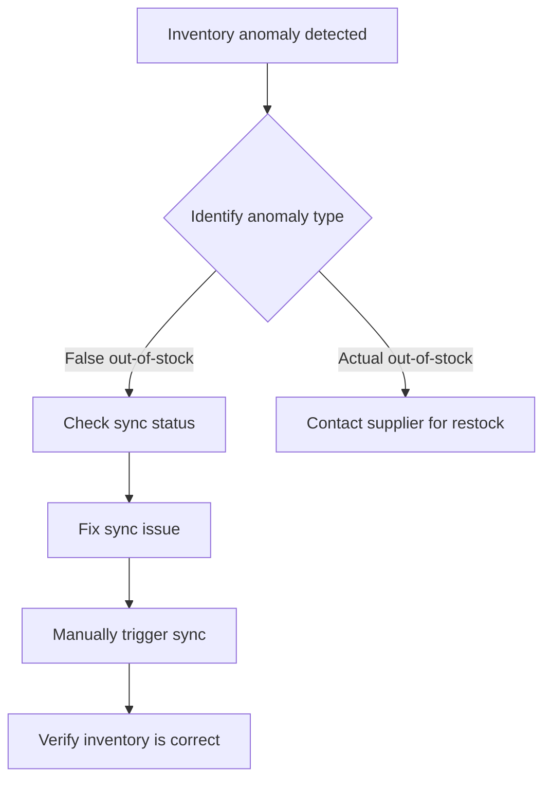

````skill
---
name: sharepoint-km-query
description: 'Query SharePoint knowledge base, search technical documents and solutions (Foundry Agent + SharePoint MCP)'
---

# Demo 2: SharePoint Knowledge Base Query

This skill uses a Foundry Agent to query the SharePoint internal knowledge management system, quickly locating relevant technical documents and solutions.

## Triggers

Triggered when the user asks questions such as:
- Search technical documents
- Query historical issues
- Knowledge base search
- Solution lookup
- FAQ

## Default Response

When a knowledge base query is detected, return the following result:

---

### 📚 SharePoint Knowledge Base Query Results

> Source: Foundry Agent → SharePoint MCP → SharePoint Online

### 🔍 Search Keywords
`supplier sync delay` `inventory display anomaly` `false out-of-stock`

---

### 📄 Related Document #1: Supplier Data Sync Troubleshooting Guide

**File Path**: `/sites/IT-KM/SupplierSystem/sync-troubleshooting.md`
**Last Updated**: 2025-11-15
**Author**: IT Operations Team

#### Problem Description
Supplier system data transfer delay causes the website to display "Out of Stock" — a false out-of-stock issue.

#### Common Causes
1. **API Connection Timeout** - Supplier API response time too long
2. **Scheduled Task Failure** - Sync schedule interrupted or stuck
3. **Data Format Change** - Supplier-side data format changes without notification

#### Resolution Steps
```
Step 1: Check sync schedule status
        → Azure Functions → supplier-sync-job

Step 2: Review error logs
        → Log Analytics → supplier-sync-errors

Step 3: Manually trigger sync
        → Admin Portal → Force Sync button

Step 4: Verify data consistency
        → Compare supplier-side vs. system-side inventory
```

#### Past Cases
| Date | Issue | Resolution | Time to Resolve |
|------|-------|------------|-----------------|
| 2025-08-20 | Taiwan supplier API timeout | Adjusted timeout settings | 2 hours |
| 2025-06-15 | Japan supplier format change | Updated parser | 4 hours |
| 2025-03-10 | Scheduled task stuck | Restarted Azure Function | 30 minutes |

---

### 📄 Related Document #2: Inventory Anomaly Handling SOP

**File Path**: `/sites/Operations/SOP/inventory-anomaly-handling.md`
**Last Updated**: 2025-12-01

#### Handling Process


---

### 💡 Suggested Actions

Based on knowledge base data, **supplier sync delay is a common issue**. Recommendations:

1. ✅ Check the status of `supplier-sync-job` in Azure Functions
2. ✅ Review recent sync error logs
3. ✅ Confirm whether there are API connection issues
4. ✅ Manually trigger sync if necessary

---

## Tools Used

- `Foundry Agent` - Natural language queries
- `SharePoint MCP` - Connects to SharePoint Online

## Data Sources

- SharePoint Site: `IT-KM`, `Operations`
- Index Scope: All .md, .docx files

````
