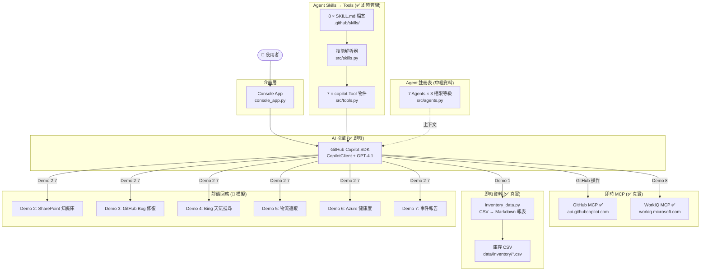
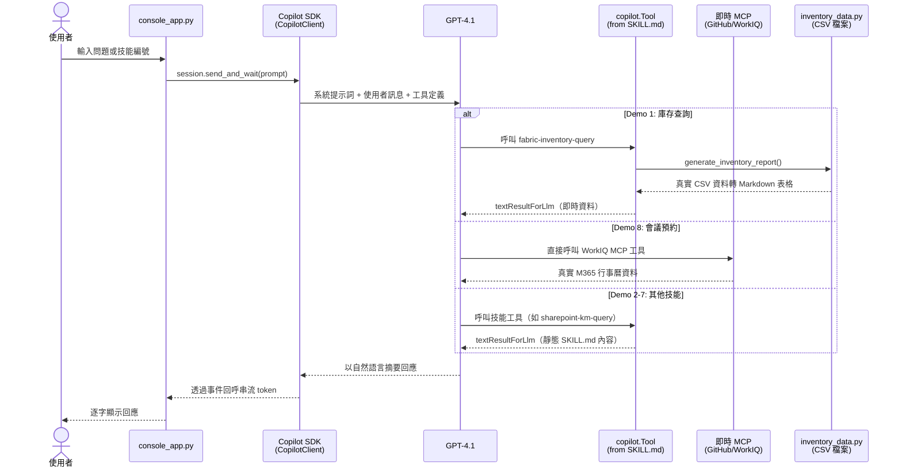

# 🍍 Zava 智慧助理 — 企業事件回應 AI Agent

> **Agents League TechConnect — Battle #1: Creative Apps with GitHub Copilot**

Zava 是一款基於 **GitHub Copilot SDK** 打造的企業級事件回應 AI 助理。透過 Copilot SDK 的 **Agent Skills** 機制，將 Markdown 定義的技能檔案轉換為 SDK `Tool` 物件，整合 **5 類 7 個專業 Agent**、**3 個可切換自訂 Agent**、以及 **9 個 MCP 連接器**，展示 AI Agent 如何即時處理跨國產品缺貨事件的完整流程。

---

## ⚠️ 即時功能 vs 模擬展示 標示

> **本專案為 Demo/POC 應用程式。** 下表明確標示哪些元件為完整功能（即時），哪些使用預先撰寫的靜態回應（模擬），以確保離線 Demo 的穩定性。

| 元件 | 狀態 | 說明 |
|------|------|------|
| **Copilot SDK 引擎** | ✅ 即時 | `CopilotClient` 工作階段、串流、工具呼叫 — 核心 AI 執行時 |
| **Agent Skills → Tool 管線** | ✅ 即時 | `.github/skills/*/SKILL.md` → 解析 → `copilot.Tool` 物件註冊於 SDK |
| **系統提示詞與治理** | ✅ 即時 | 權限升級、工具路由規則透過 `src/prompts.py` 實現 |
| **GitHub MCP** | ✅ 即時 | 真實 HTTP MCP（`api.githubcopilot.com/mcp/`）註冊於 SDK 工作階段 |
| **WorkIQ MCP** | ✅ 即時 | 真實 HTTP MCP（`workiq.microsoft.com/mcp/`）註冊於 SDK 工作階段 |
| **庫存 CSV 資料（Demo 1）** | ✅ 即時 | `src/inventory_data.py` 讀取 `data/inventory/` 真實 CSV 檔案 |
| **意圖路由器** | ✅ 即時 | `src/router.py` 關鍵字分類（獨立模組，console 流程由 LLM 處理路由） |
| **Agent 註冊表與權限** | ✅ 即時 | `src/agents.py` 定義 7 個 Agent 及權限模型 |
| **自動化測試** | ✅ 即時 | 181 項 pytest 測試，100% 通過 |
| **Foundry Agent（Demo 1 ref）** | 🔶 參考 | `ref/01_inventory_agent_sample.py` — 獨立腳本，需 Azure AI Foundry 憑證，未整合至 console app |
| **Fabric MCP** | 🔶 模擬 | 僅為 Agent 中繼資料標籤；Demo 1 工具回傳即時 CSV 資料，非真實 Fabric MCP |
| **SharePoint MCP** | 🔶 模擬 | Agent 中繼資料標籤；Demo 2 回傳靜態 SKILL.md 回應 |
| **Bing Search MCP** | 🔶 模擬 | Agent 中繼資料標籤；Demo 4 回傳靜態 SKILL.md 回應 |
| **Logistics MCP** | 🔶 模擬 | Agent 中繼資料標籤；Demo 5 回傳靜態 SKILL.md 回應 |
| **Azure Monitor MCP** | 🔶 模擬 | Agent 中繼資料標籤；Demo 6 回傳靜態 SKILL.md 回應 |
| **Playwright MCP** | 🔶 已設定 | 列於 `config/mcp_server.json` 但未註冊於 SDK 工作階段 |
| **Filesystem MCP** | 🔶 已設定 | 列於 `config/mcp_server.json` 但未註冊於 SDK 工作階段 |
| **自訂 Agent 切換** | 🔶 模擬 | `/agent N` 顯示 Agent 資訊但不會更換 SDK 工作階段提示詞 |
| **Demo 2–7 技能回應** | 🔶 模擬 | 回傳 SKILL.md 檔案中預先撰寫的 Markdown |
| **權限升級** | 🔶 提示詞驅動 | 完全透過系統提示詞指令實現，非程式碼層面檢查 |

---

## 🎯 情境說明

**Zava「101 造型鳳梨酥」** — 招牌商品在台灣、日本、美國三地出現缺貨問題。Zava 引導使用者走過完整事件處理流程：診斷根因、協調修復、追蹤物流、產生報告 — 全程以自然對話完成。

---

## 🎬 Demo 影片

▶️ [**觀看完整 Demo 演示**](https://1drv.ms/v/c/997cab12c6465ec0/IQD-iC5-1n-0RLDMqW4hBzl8ARe247dwd3hBFbPYWpUtj7k?e=f79DkO)

📄 [**簡報投影片 (PDF)**](doc/Zava_Unified_Enterprise_Agents.pdf)

---

## ✨ Demo 階段與技術總覽

| 階段 | Demo | Agent / Tool | MCP | 資料來源 | 狀態 |
|------|------|--------------|-----|----------|------|
| **階段一：確認問題** | Demo 1 — 庫存查詢 | Inventory Agent | Fabric MCP | ✅ 即時 CSV（`data/inventory/`） | ✅ 即時資料 |
| | Demo 2 — 知識庫搜尋 | Knowledge Agent | SharePoint MCP | SharePoint KM 文件 | 🔶 靜態 |
| **階段二：修改問題** | Demo 3 — Bug 修復 | GitHub Coding Agent | — | GitHub Repo | 🔶 靜態 |
| **階段三：確認成效** | Demo 4 — 天氣與新聞 | Search Agent | Bing Search MCP | Bing 搜尋結果 | 🔶 靜態 |
| | Demo 5 — 物流追蹤 | Logistics Agent | Logistics MCP | 物流追蹤 DB | 🔶 靜態 |
| | Demo 6 — 系統健康度 | SRE Agent | Azure Monitor MCP | Azure Logs/Metrics | 🔶 靜態 |
| **階段四：報告追蹤** | Demo 7 — 事件報告 | GitHub Copilot | — | 事件上下文 | 🔶 靜態 |
| | Demo 8 — 會議預約 | GitHub Copilot | WorkIQ MCP | M365 Calendar | ✅ 即時 MCP |

> **✅ 即時** = 執行時取得真實資料或真實 MCP 呼叫 | **🔶 靜態** = SKILL.md 預先撰寫的回應

### Human-in-the-Loop 治理機制

Zava 實作了**權限升級**流程，完全透過系統提示詞實現：

- 初始僅具備「區域檢視」權限
- 查詢跨區域資料前須取得主管核准
- 展示企業級 AI Agent 治理模式（非程式碼層面強制）

---

## 🏗️ 系統架構

### 實際運作原理（程式碼層級）

```
使用者輸入（console_app.py）
    → CopilotClient.send_and_wait(prompt)
    → GPT-4.1（透過 Copilot SDK）分析意圖
    → LLM 選擇要呼叫的 Tool（從 7 個已註冊工具中）
    → Tool handler 執行：
        ├── Demo 1: generate_inventory_report() → 真實 CSV 資料
        ├── Demo 8: 重導至 WorkIQ MCP → 真實 MCP 呼叫
        └── Demo 2-7: 回傳 SKILL.md 靜態回應
    → LLM 以自然語言摘要結果
    → 回應逐字串流至 Console
```

### 架構層級

| 層級 | 組件 | 實作方式 |
|------|------|----------|
| **介面層** | Console App | `console_app.py` — 非同步 CLI，含 `/skills`、`/mcp`、`/agent` 指令 |
| **AI 引擎** | GitHub Copilot SDK | `CopilotClient` → 工具 + MCP 伺服器 + 串流工作階段 |
| **工具管線** | Agent Skills | `.github/skills/` → `src/skills.py` → `src/tools.py` → `copilot.Tool` |
| **Agent 模型** | 7 Agent + 3 自訂 | `src/agents.py` — 含權限等級的註冊表（路由上下文中繼資料） |
| **MCP（即時）** | 2 個 HTTP MCP | GitHub MCP + WorkIQ MCP 註冊於 SDK 工作階段 |
| **MCP（已設定）** | 2 個本地 MCP | Playwright + Filesystem 於 `config/mcp_server.json` |
| **MCP（模擬）** | 5 個靜態標籤 | Fabric、SharePoint、Bing、Logistics、Azure Monitor — `src/agents.py` 中繼資料 |
| **資料層** | CSV + Markdown | `data/inventory/*.csv`、`data/sharepoint-km/*.md`、`data/customer-complaints/*.json` |



### 🔐 Agent 權限分類表

| Agent 類別 | Agent 名稱 | 權限等級 | MCP 連接器 | Demo | 資料狀態 |
|------------|-----------|----------|------------|------|----------|
| 📊 Data | Inventory Agent | 🔴 高 | fabric-mcp 🔶 | Demo 1 | ✅ 即時 CSV |
| 📊 Data | Logistics Agent | 🔴 高 | logistics-mcp 🔶 | Demo 5 | 🔶 靜態 |
| 📚 Knowledge | Knowledge Agent | 🟡 中 | sharepoint-mcp 🔶 | Demo 2 | 🔶 靜態 |
| 🌐 External | Search Agent | 🟢 低 | bing-search-mcp 🔶 | Demo 4 | 🔶 靜態 |
| ⚙️ Ops | SRE Agent | 🔴 高 | azure-monitor-mcp 🔶 | Demo 6 | 🔶 靜態 |
| 🛠️ GitHub | Coding Agent | 🔴 高 | — | Demo 3 | 🔶 靜態 |
| 🛠️ GitHub | Copilot | 🟡 中 | workiq-mcp ✅ | Demo 7-8 | Demo 8 ✅ 即時 |

### 🧑‍💼 自訂 Agent（Console 可切換）

透過 `/agent` 指令可瀏覽 3 個自訂 Agent：

| # | Agent 名稱 | 說明 |
|---|-----------|------|
| 1 | **R&D Assistant** | 程式碼審查、技術文件撰寫、架構設計建議 |
| 2 | **Customer Support** | 客戶問題處理、FAQ 查詢、工單追蹤 |
| 3 | **Finance Analyst** | 財報分析、預算規劃、成本估算與 ROI 分析 |

> 🔶 **注意**：目前 `/agent N` 僅顯示 Agent 資訊，不會切換 SDK 工作階段的系統提示詞。Agent 定義存放於 `config/agent.json`。

---

## 🔌 MCP 整合

### Session 層級 MCP（✅ 註冊於 Copilot SDK）

這 2 個 MCP 伺服器在 `CopilotClient.create_session()` 中註冊，提供真實即時資料：

| MCP | 類型 | 端點 | 用途 |
|-----|------|------|------|
| GitHub MCP ✅ | HTTP | `api.githubcopilot.com/mcp/` | GitHub Issue / PR / Repo 操作 |
| WorkIQ MCP ✅ | HTTP | `workiq.microsoft.com/mcp/` | M365 行事曆查詢與會議排程 |

### 已設定 MCP（列於 `config/mcp_server.json`）

| MCP | 類型 | 狀態 |
|-----|------|------|
| Playwright MCP | 本地（`npx`） | 🔶 已列出但未註冊於 SDK 工作階段 |
| Filesystem MCP | 本地（`npx`） | 🔶 已列出但未註冊於 SDK 工作階段 |

### Agent 層級 MCP（🔶 中繼資料標籤）

| MCP 標籤 | Agent | 資料來源 | 實際行為 |
|----------|-------|---------|----------|
| fabric-mcp | Inventory Agent | Fabric Lakehouse | 工具讀取本地 CSV 檔案，非真實 Fabric |
| sharepoint-mcp | Knowledge Agent | SharePoint 文件庫 | 回傳 SKILL.md 靜態回應 |
| bing-search-mcp | Search Agent | Bing 搜尋引擎 | 回傳 SKILL.md 靜態回應 |
| logistics-mcp | Logistics Agent | 物流追蹤 DB | 回傳 SKILL.md 靜態回應 |
| azure-monitor-mcp | SRE Agent | Azure Monitor | 回傳 SKILL.md 靜態回應 |

### 即時 MCP 路由邏輯（`src/tools.py`）

```python
LIVE_MCP_SKILLS: dict[str, str] = {
    "workiq-meeting-booking": "workiq",  # Demo 8 → 真實 WorkIQ MCP
}
```

- `LIVE_MCP_SKILLS` 中的技能於 `build_tools()` 時被**跳過** — LLM 直接呼叫真實 MCP 伺服器工具
- 其餘技能轉為 `copilot.Tool` 物件，附帶靜態 handler
- Demo 1（`fabric-inventory-query`）有特殊 handler，讀取即時 CSV 資料

### 容錯降級設計

- **即時 MCP** — 若 GitHub/WorkIQ MCP 伺服器不回應，Zava 如實告知使用者並建議重試
- **靜態 MCP** — SKILL.md 工具回傳預先撰寫的回應，確保離線 Demo 可正常運作
- `LIVE_MCP_SKILLS` 字典控制哪些技能走即時 MCP、哪些走靜態回應 — 易於擴展

---

## 🚀 快速開始

### 環境需求

- Python 3.11+
- [GitHub Copilot](https://github.com/features/copilot) 訂閱
- Node.js（用於 Playwright/Filesystem MCP 伺服器，如需啟用）
- Azure 訂閱 + [AI Foundry 專案](https://ai.azure.com)（僅 `ref/` Foundry Agent 腳本需要）

### 安裝步驟

```bash
git clone https://github.com/<your-org>/poc-agents-league-techconnect-2026.git
cd poc-agents-league-techconnect-2026

python -m venv .venv
source .venv/bin/activate  # macOS/Linux

pip install .
```

### 環境變數

```bash
cp .env.example .env
```

| 變數名稱 | 必要 | 說明 |
|----------|------|------|
| `GITHUB_TOKEN` | 是 | 用於 MCP 的 GitHub 個人存取權杖 |
| `AZURE_EXISTING_AIPROJECT_ENDPOINT` | 僅 `ref/` | AI Foundry 專案端點 |
| `AGENT_MODEL` | 否 | 模型部署名稱（預設：`gpt-4.1`） |

### 啟動應用

```bash
python console_app.py
# 或
zava
```

### Console 指令

| 指令 | 說明 |
|------|------|
| `/skills` | 顯示所有可用技能 |
| `/mcp` | 顯示 MCP 伺服器清單與連線狀態 |
| `/agent` | 瀏覽可切換的自訂 Agent |
| `/agent N` | 切換至第 N 個自訂 Agent（如 `/agent 1`） |
| `/help` | 顯示完整指令手冊 |
| `/exit` | 離開程式 |
| `1-8` | 輸入數字直接選擇對應技能 |
| `?` | 顯示技能選單 |

### 執行測試

```bash
pip install -e ".[test]"
pytest tests/ -v --tb=short
# 預期：181 passed in ~0.4s
```

---

## 📁 專案結構

```
poc-agents-league-techconnect-2026/
├── console_app.py          # ✅ 主進入點 — Copilot SDK 工作階段 + Console UI
├── pyproject.toml           # Python 專案設定與依賴
├── requirements.txt         # Pip 依賴清單（與 pyproject.toml 同步）
├── .env.example             # 環境變數範本
│
├── src/
│   ├── __init__.py
│   ├── agents.py            # ✅ 7 個 Agent 定義 + 權限模型（中繼資料）
│   ├── router.py            # ✅ 關鍵字意圖路由器（獨立模組）
│   ├── prompts.py           # ✅ 系統提示詞含工具路由 + 治理規則
│   ├── skills.py            # ✅ SKILL.md YAML frontmatter 解析器 + 載入器
│   ├── tools.py             # ✅ Skills → copilot.Tool 物件 + MCP 路由
│   ├── inventory_data.py    # ✅ 即時 CSV 讀取器 → Markdown 庫存報表
│   └── exceptions.py        # 自訂例外類別
│
├── .github/skills/          # ✅ 8 個技能定義（YAML + Markdown）
│   ├── demo1-fabric-inventory/SKILL.md    # → ✅ 即時 CSV 資料
│   ├── demo2-sharepoint-km/SKILL.md       # → 🔶 靜態回應
│   ├── demo3-github-bugfix/SKILL.md       # → 🔶 靜態回應
│   ├── demo4-bing-weather/SKILL.md        # → 🔶 靜態回應
│   ├── demo5-logistics/SKILL.md           # → 🔶 靜態回應
│   ├── demo6-azure-health/SKILL.md        # → 🔶 靜態回應
│   ├── demo7-incident-report/SKILL.md     # → 🔶 靜態回應
│   └── demo8-meeting-booking/SKILL.md     # → ✅ 即時 MCP（WorkIQ）
│
├── config/
│   ├── agent.json           # 3 個自訂 Agent 定義（R&D/Support/Finance）
│   └── mcp_server.json      # 4 個 MCP 伺服器設定（GitHub/WorkIQ/Playwright/FS）
│
├── data/                    # Demo 資料來源
│   ├── inventory/           # ✅ Demo 1 即時 CSV 資料
│   │   ├── tw_supplier_inventory.csv
│   │   ├── jp_supplier_inventory.csv
│   │   └── us_supplier_inventory.csv
│   ├── customer-complaints/ # 客訴 JSON 記錄
│   └── sharepoint-km/       # 知識管理 Markdown 文件
│
├── ref/                     # 🔶 參考/獨立腳本（未整合）
│   ├── 00_env_check.py      # Azure 憑證 + 連線驗證
│   ├── 01_inventory_agent_sample.py  # 透過 azure-ai-projects SDK 的 Foundry Agent
│   └── agent_utils.py       # ref/ 腳本共用工具
│
├── tests/                   # ✅ 181 項自動化測試（pytest）
│   ├── conftest.py          # 共用 fixtures
│   ├── test_agents.py       # Agent 註冊與權限測試（29）
│   ├── test_router.py       # 意圖分類與路由測試（50）
│   ├── test_skills.py       # SKILL.md 解析器測試（18）
│   ├── test_tools.py        # Tool 建構器測試（10）
│   ├── test_mcp.py          # MCP 設定測試（12）
│   ├── test_integration.py  # 端對端管線測試（18）
│   └── test_foundry_agent.py # Foundry Agent 結構驗證（24）
│
└── copilot/generated/       # Copilot SDK 產生的程式碼（gitkeep）
```

---

## 📋 運作原理 — 詳細流程

### 核心管線：Copilot SDK Agent Skills



### 逐步說明

1. **啟動**：`console_app.py` 透過 `load_skills()` 載入技能，`build_tools()` 轉為 `copilot.Tool`，初始化 `CopilotClient`
2. **工作階段**：SDK 工作階段建立，包含 GPT-4.1、7 個工具、系統提示詞、2 個即時 MCP 伺服器（GitHub + WorkIQ）
3. **使用者輸入**：使用者輸入問題或選擇技能編號（1-8）
4. **LLM 路由**：GPT-4.1 讀取系統提示詞（列出全部 8 個技能與 MCP 路由規則），決定呼叫哪個工具
5. **工具執行**：選中工具的非同步 handler 執行：
   - **Demo 1**：`generate_inventory_report()` 讀取 CSV → 回傳真實資料（Markdown）
   - **Demo 8**：Handler 回傳重導訊息；LLM 直接呼叫 WorkIQ MCP 工具
   - **其他**：Handler 回傳 `skill.response_content`（SKILL.md 靜態 Markdown）
6. **回應**：LLM 解讀工具結果並生成自然語言摘要，串流至 Console

### 為何路由器是獨立模組

`src/router.py` 提供獨立的關鍵字意圖分類器（使用者輸入 → Agent + 意圖 + 信心分數）。雖然**未在 `console_app.py` 中呼叫**（由 LLM 處理路由），它的用途為：
- 展示意圖分類邏輯
- 可測試元件（50 項測試案例）
- 未來非 LLM 路由的基礎

---

## 🤖 GitHub Copilot 使用紀錄

### 作為 AI 執行引擎

- **GitHub Copilot SDK**（`CopilotClient`）管理工作階段、工具呼叫、MCP 整合、串流
- 全部 8 個技能註冊為 SDK `Tool` 物件
- SDK 處理對話迴圈、工具分派、回應彙整

### 作為專業 Agent

- **Demo 7** — LLM 根據對話上下文產生事件報告（使用靜態技能範本）
- **Demo 8** — LLM 呼叫 WorkIQ MCP 查詢真實 M365 Calendar 資料並排程會議

### 開發過程中的使用

- **Copilot Chat** 用於設計 Agent 路由框架、除錯非同步串流模式、生成系統提示詞
- **Copilot Agent Mode** 協助搭建 Foundry Agent 整合與 MCP client 設定
- **行內建議** 加速編寫 YAML frontmatter 解析器與工具建構器

---

## 📎 參考：Foundry Agent（ref/）

`ref/` 目錄包含展示 Azure AI Foundry Agent 整合的獨立腳本：

| 腳本 | 說明 | 需要 |
|------|------|------|
| `00_env_check.py` | 驗證 Azure 憑證與連線 | Azure 憑證 |
| `01_inventory_agent_sample.py` | 建立含嵌入庫存資料的 Foundry Agent | Azure AI Foundry 專案 |
| `agent_utils.py` | Foundry 腳本共用工具函式 | Azure 憑證 |

這些腳本**未整合**至 console app 流程中。展示從 Copilot SDK 技能到 Production Azure AI Foundry Agent 的演進路徑，使用 `azure-ai-projects` GA SDK。

---

## 📄 授權

本專案為參加 Agents League TechConnect 黑客松的原創作品。

## 🔗 相關連結

- [Agents League TechConnect](https://github.com/microsoft/agentsleague-techconnect)
- [GitHub Copilot SDK](https://github.com/github/copilot-sdk)
- [Azure AI Foundry](https://ai.azure.com)
- [WorkIQ MCP](https://github.com/microsoft/work-iq-mcp)
- [GitHub MCP Server](https://github.com/github/github-mcp-server)

---

[English README](README.md)
