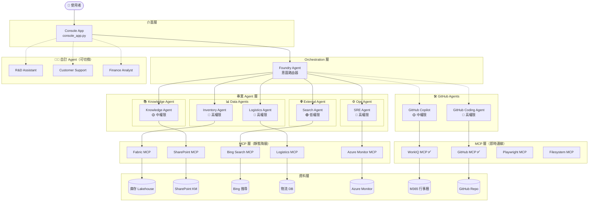
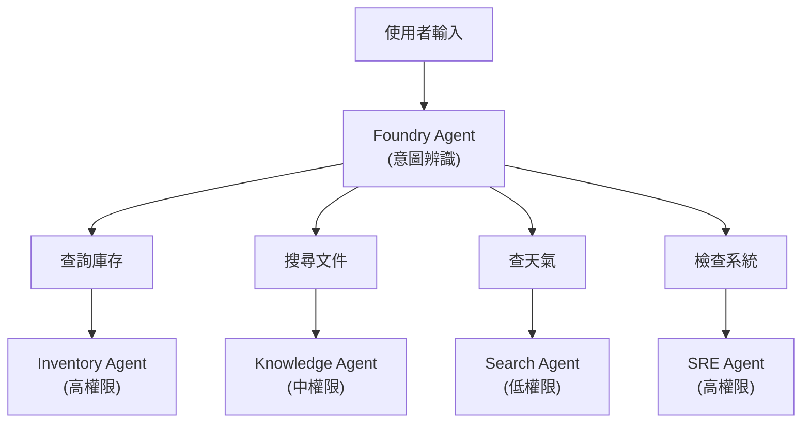

# 🍍 Zava 智慧助理 — 企業事件回應 AI Agent

> **Agents League TechConnect — Battle #1: Creative Apps with GitHub Copilot**

Zava 是一款基於 **GitHub Copilot SDK** 打造的企業級事件回應 AI 助理。透過整合多種工具與資料來源，展示 AI Agent 如何即時處理跨國產品缺貨事件的完整流程。系統包含 **5 類 7 個專業 Agent**、**3 個可切換的自訂 Agent**，以及 **8 個 MCP 連接器**（含 2 個即時連線 + 6 個靜態降級）。

## 🎯 情境說明

**Zava「101 造型鳳梨酥」** — 招牌商品在台灣、日本、美國三地出現缺貨問題。Zava 引導使用者走過完整事件處理流程：診斷根因、協調修復、追蹤物流、產生報告 — 全程以自然對話完成。

## ✨ Demo 階段與技術總覽

| 階段 | Demo | Agent / Tool | MCP | 資料來源 |
|------|------|--------------|-----|----------|
| **階段一：確認問題** | Demo 1 — 庫存查詢 ✅ | Foundry Agent (已實作) | Fabric MCP | Fabric Lakehouse (庫存表) |
| | Demo 2 — 知識庫搜尋 | Foundry Agent | SharePoint MCP | SharePoint KM 文件 |
| **階段二：修改問題** | Demo 3 — Bug 修復 | GitHub Coding Agent | — | GitHub Repo (Bug 程式碼) |
| **階段三：確認成效** | Demo 4 — 天氣與新聞 | Foundry Agent | Bing Search MCP | Bing 搜尋結果 |
| | Demo 5 — 物流追蹤 | Foundry Agent | Logistics MCP | 物流追蹤 DB |
| | Demo 6 — 系統健康度 | Foundry Agent | Azure Monitor MCP | Azure Logs / Metrics |
| **階段四：報告追蹤** | Demo 7 — 事件報告 | GitHub Copilot | — | 事件上下文 |
| | Demo 8 — 會議預約 | GitHub Copilot | WorkIQ MCP | M365 Calendar |

### Human-in-the-Loop 治理機制

Zava 實作了**權限升級**流程：

- 初始僅具備「區域檢視」權限
- 查詢跨區域資料前須取得主管核准
- 展示企業級 AI Agent 治理模式

## 🏗️ 系統架構

### 架構層級

| 層級 | 組件 | 說明 |
|------|------|------|
| **介面層** | Console App | Console 命令列 (`console_app.py`) |
| **Orchestration 層** | Foundry Agent | 統一路由入口，根據意圖分派給專業 Agent |
| **專業 Agent 層** | 5 類 7 個專業 Agent + 3 個自訂 Agent | 依權限分類，各司其職；另有 3 個可切換的自訂 Agent |
| **MCP 層** | 8 個 MCP 連接器 | 2 個即時連線（GitHub、WorkIQ）+ 6 個靜態降級 + Playwright、Filesystem |
| **資料層** | 7+ 種資料來源 | 企業內外部資料 |



### 🔐 Agent 權限分類表

| Agent 類別 | Agent 名稱 | 權限等級 | 可存取資源 | Demo |
|------------|-----------|----------|-----------|------|
| 📊 Data Agent | Inventory Agent ✅ | 🔴 高 | Fabric Lakehouse (庫存資料) | Demo 1 (已實作) |
| | Logistics Agent | 🔴 高 | 物流系統 DB | Demo 5 |
| 📚 Knowledge Agent | Knowledge Agent | 🟡 中 | SharePoint 內部文件 | Demo 2 |
| 🌐 External Agent | Search Agent | 🟢 低 | Bing 公開搜尋 | Demo 4 |
| ⚙️ Ops Agent | SRE Agent | 🔴 高 | Azure Monitor Logs/Metrics | Demo 6 |
| 🛠️ GitHub Agent | Coding Agent | 🔴 高 | GitHub Repo (寫入) | Demo 3 |
| 🛠️ GitHub Agent | Copilot | 🟡 中 | M365 Calendar | Demo 7-8 |

### 🧑‍💼 自訂 Agent（Console 可切換）

Console App 額外提供 3 個可切換的自訂 Agent，透過 `/agent` 指令選擇：

| # | Agent 名稱 | 說明 |
|---|-----------|------|
| 1 | **R&D Assistant** | 程式碼審查、技術文件撰寫、架構設計建議 |
| 2 | **Customer Support** | 客戶問題處理、FAQ 查詢、工單追蹤 |
| 3 | **Finance Analyst** | 財報分析、預算規劃、成本估算與 ROI 分析 |

> 這些 Agent 各有獨立的系統提示詞，可用於展示「同一 Copilot SDK 基座、不同領域 Agent」的彈性。

**為什麼要依權限分類 Agent？**

1. **最小權限原則** — 每個 Agent 只擁有完成任務所需的最小權限
2. **安全隔離** — External Agent 無法存取內部資料
3. **審計追蹤** — 可追蹤哪個 Agent 存取了哪些資源
4. **彈性擴展** — 新增資料來源時，只需建立對應權限的 Agent

### Foundry Agent 路由邏輯



## 🚀 快速開始

### 環境需求

- Python 3.11+
- [GitHub Copilot](https://github.com/features/copilot) 訂閱
- Node.js（用於 MCP 伺服器）
- Azure 訂閱 + [AI Foundry 專案](https://ai.azure.com)（用於 Demo 1 Foundry Agent）

### 安裝步驟

```bash
# 複製專案
git clone https://github.com/<your-org>/poc-ai-summit-2026.git
cd poc-ai-summit-2026

# 建立虛擬環境
python -m venv .venv
source .venv/bin/activate  # macOS/Linux
# .venv\Scripts\activate   # Windows

# 安裝依賴
pip install .
```

### 環境變數

複製範本檔案並填入你的憑證：

```bash
cp .env.example .env
```

必要變數：

| 變數名稱 | 說明 |
|----------|------|
| `GITHUB_TOKEN` | 用於 MCP 的 GitHub 個人存取權杖 |
| `AZURE_EXISTING_AIPROJECT_ENDPOINT` | AI Foundry 專案端點（Demo 1 庫存 Agent 需要） |
| `AGENT_MODEL` | 模型部署名稱（預設：`gpt-4.1`） |

### 啟動應用

**命令列介面（Console）：**

```bash
python console_app.py
```

### Console 指令

| 指令 | 說明 |
|------|------|
| `/skills` | 顯示所有可用技能 |
| `/mcp` | 顯示 MCP 伺服器清單與連線狀態 |
| `/agent` | 瀏覽可切換的自訂 Agent |
| `/agent N` | 切換至第 N 個自訂 Agent（如 `/agent 1`） |
| `/help` | 顯示完整指令手冊 |
| `/exit` | 離開程式 |
| `1-8` | 輸入數字直接選擇對應技能 |
| `?` | 顯示技能選單 |

## 🔌 MCP 整合

本專案整合了 **8 個 MCP (Model Context Protocol) 連接器**，分為「即時連線」與「靜態降級」兩種模式：

### 即時連線 MCP（Session 層級註冊）

以下 MCP 在 `console_app.py` 中以 `mcp_servers` 設定直接連線，提供真實即時資料：

| MCP | 類型 | 端點 | 使用 Agent | 說明 |
|-----|------|------|-----------|------|
| GitHub MCP ✅ | HTTP | `api.githubcopilot.com/mcp/` | Coding Agent | GitHub Issue / PR / Repo 操作 |
| WorkIQ MCP ✅ | HTTP | `workiq.microsoft.com/mcp/` | Copilot | M365 行事曆查詢與會議排程 |
| Playwright MCP | Local | `npx @anthropic/playwright-mcp` | — | 瀏覽器自動化、截圖、網頁爬蟲 |
| Filesystem MCP | Local | `npx @modelcontextprotocol/server-filesystem` | — | 本地檔案系統存取 |

### 靜態降級 MCP（Agent 層級標註）

以下 MCP 在 `src/agents.py` 中標註為 `mcp_connector`，透過 SKILL.md 提供預設回應。當對應的 MCP 伺服器上線後，可無縫切換至即時模式：

| MCP | 使用 Agent | 資料來源 | 說明 |
|-----|-----------|---------|------|
| Fabric MCP | Inventory Agent | Fabric Lakehouse | 跨區域庫存查詢（台/日/美） |
| SharePoint MCP | Knowledge Agent | SharePoint 文件庫 | 內部知識管理文件搜尋 |
| Bing Search MCP | Search Agent | Bing 搜尋引擎 | 即時公開資訊（天氣、新聞） |
| Logistics MCP | Logistics Agent | 物流追蹤 DB | 出貨狀態與預計到達時間 |
| Azure Monitor MCP | SRE Agent | Azure Logs/Metrics | 系統健康狀態監控 |

### 容錯降級設計

- **即時 MCP** — 若伺服器不回應，系統會如實告知使用者 MCP 連線失敗，建議重試
- **靜態 MCP** — 對應的 SKILL.md 工具自動回傳預先撰寫的回應，確保離線 Demo 可正常運作
- 在 `src/tools.py` 中，`LIVE_MCP_SKILLS` 字典控制哪些技能走即時 MCP、哪些走靜態回應

## 🤖 GitHub Copilot 使用紀錄

本專案以兩種角色運用 **GitHub Copilot**：

### 作為 AI 執行引擎

- **GitHub Copilot SDK** 作為核心 AI 引擎，管理工作階段、工具呼叫與串流回應
- 使用者透過 Console App 以自然語言與整個 Agent 生態系互動

### 作為專業 Agent

- **Demo 7** — GitHub Copilot 根據對話上下文產生事件報告
- **Demo 8** — GitHub Copilot 整合 WorkIQ MCP 安排 M365 會議

### 開發過程中的使用

- **Copilot Chat** 用於設計 Agent 路由框架、除錯非同步串流模式、以及生成系統提示詞
- **Copilot Agent Mode** 協助搭建 Foundry Agent 整合與 MCP client 設定
- **行內建議** 加速編寫 YAML frontmatter 解析器與工具建構器

## 📁 專案結構

```
agents-league-techconnect-2026/
├── console_app.py        # Console 命令列進入點（含 /skills、/mcp、/agent 指令）
├── pyproject.toml        # Python 專案設定與依賴
├── requirements.txt      # Pip 依賴清單（與 pyproject.toml 同步）
├── .env.example          # 環境變數範本
│
├── src/
│   ├── __init__.py
│   ├── agents.py         # Agent 定義與權限模型（7 個 Agent）
│   ├── router.py         # Foundry Agent 意圖路由器
│   ├── prompts.py        # 系統提示詞（英文）
│   ├── skills.py         # SKILL.md 載入與解析
│   └── tools.py          # Copilot SDK Tool 建構器 + MCP 路由
│
├── tests/                # 自動化測試套件（pytest）
│   ├── conftest.py       # 共用 fixture 與設定
│   ├── test_agents.py    # Agent 註冊與權限測試
│   ├── test_router.py    # 意圖分類與路由測試
│   ├── test_skills.py    # SKILL.md 解析器測試
│   ├── test_tools.py     # Tool 建構器測試
│   ├── test_mcp.py       # MCP 設定測試
│   └── test_integration.py # 端對端管線測試
│
├── data/                 # Demo 資料來源
│   ├── customer-complaints/       # 客訴資料
│   │   ├── tw_complaints_jan25.json
│   │   ├── jp_complaints_jan25.json
│   │   └── us_complaints_jan25.json
│   ├── inventory/                 # 庫存資料 (Fabric)
│   │   ├── tw_supplier_inventory.csv
│   │   ├── jp_supplier_inventory.csv
│   │   └── us_supplier_inventory.csv
│   └── sharepoint-km/             # 知識管理文件
│       ├── common-issues-faq.md
│       ├── supplier-sync-guide.md
│       └── inventory-troubleshoot.md
│
└── .github/
    └── skills/           # 8 個技能定義（SKILL.md 檔案）
        ├── demo1-fabric-inventory/
        ├── demo2-sharepoint-km/
        ├── demo3-github-bugfix/
        ├── demo4-bing-weather/
        ├── demo5-logistics/
        ├── demo6-azure-health/
        ├── demo7-incident-report/
        └── demo8-meeting-booking/
```

## 📋 運作原理

1. **使用者輸入** — 使用者透過 Console App (`console_app.py`) 發送指令
2. **意圖辨識** — Foundry Agent 分析使用者意圖，決定分派給哪個專業 Agent
3. **Agent 路由** — 路由器 (`src/router.py`) 根據意圖類別與權限等級分派至對應的 Agent
4. **權限檢查** — Agent 系統 (`src/agents.py`) 驗證目標 Agent 是否有足夠權限執行請求的操作
5. **MCP 呼叫** — 即時 MCP（GitHub、WorkIQ）直接連線取得資料；靜態 MCP 回傳 SKILL.md 預設回應
6. **結果彙整** — Foundry Agent 彙整回應，以自然對話方式回覆使用者

> **備註**：Console App 另支援 `/agent` 指令切換至自訂 Agent（R&D / Customer Support / Finance），各有獨立系統提示詞。

## � Demo 展示

> TODO: 提交前請在此新增 Demo 影片連結與擷取畫面。

## �📄 授權

本專案為參加 Agents League TechConnect 黑客松的原創作品。

## 🔗 相關連結

- [Agents League TechConnect](https://github.com/microsoft/agentsleague-techconnect)
- [GitHub Copilot SDK](https://github.com/github/copilot-sdk)
- [Azure AI Foundry](https://ai.azure.com) — Agent Service + Responses API
- [azure-ai-projects SDK](https://pypi.org/project/azure-ai-projects/) — Foundry Agent Python SDK
- [WorkIQ MCP](https://github.com/microsoft/work-iq-mcp)
- [GitHub MCP Server](https://github.com/github/github-mcp-server)

---

[English README](README.md)
