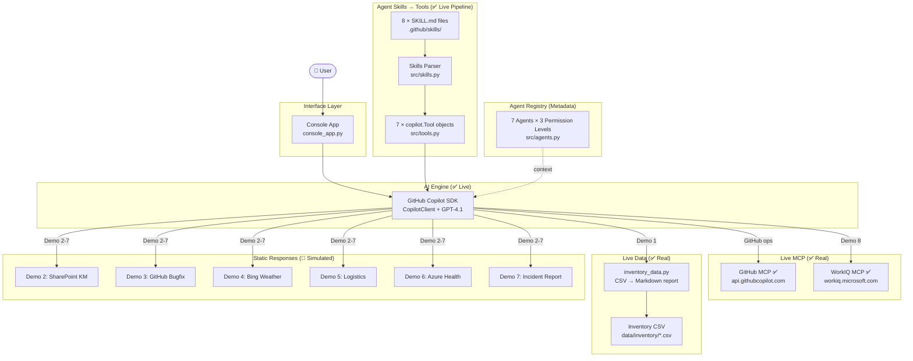
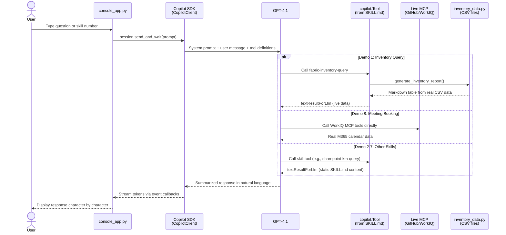

# 🍍 Zava Smart Assistant — Enterprise Incident Response AI Agent

> **Agents League TechConnect — Battle #1: Creative Apps with GitHub Copilot**

Zava is an AI-powered enterprise incident response assistant built with the **GitHub Copilot SDK**. It demonstrates how a single conversational interface can orchestrate multiple AI agents, tools, and data sources to handle a cross-regional product outage scenario in real time.

The system leverages the **Copilot SDK's Agent Skills** mechanism — converting Markdown-defined skill files into SDK `Tool` objects — to unify **7 specialized agents**, **3 switchable custom agents**, and **9 MCP connectors** under one coherent experience.

---

## ⚠️ Real vs Simulated Components

> **This project is a demo/POC application.** The table below clearly marks which components are fully functional (live) and which use pre-authored static responses (simulated) to ensure reliable offline demo capability.

| Component | Status | Description |
|-----------|--------|-------------|
| **Copilot SDK Engine** | ✅ Live | `CopilotClient` session, streaming, tool calling — the core AI runtime |
| **Agent Skills → Tool Pipeline** | ✅ Live | `.github/skills/*/SKILL.md` → parsed → `copilot.Tool` objects registered in SDK |
| **System Prompt & Governance** | ✅ Live | Permission escalation, tool routing rules enforced via `src/prompts.py` |
| **GitHub MCP** | ✅ Live | Real HTTP MCP (`api.githubcopilot.com/mcp/`) registered in SDK session |
| **WorkIQ MCP** | ✅ Live | Real HTTP MCP (`workiq.microsoft.com/mcp/`) registered in SDK session |
| **Inventory CSV Data (Demo 1)** | ✅ Live | `src/inventory_data.py` reads real CSV files from `data/inventory/` |
| **Intent Router** | ✅ Live | `src/router.py` keyword classification (standalone module, not used in console flow — LLM handles routing) |
| **Agent Registry & Permissions** | ✅ Live | `src/agents.py` defines 7 agents with permission model |
| **Automated Tests** | ✅ Live | 181 pytest tests, 100% passing |
| **Foundry Agent (Demo 1 ref)** | 🔶 Reference | `ref/01_inventory_agent_sample.py` — standalone script, requires Azure AI Foundry credentials, not integrated into console app |
| **Fabric MCP** | 🔶 Simulated | Agent metadata label only; Demo 1 tool returns live CSV data, not real Fabric MCP |
| **SharePoint MCP** | 🔶 Simulated | Agent metadata label; Demo 2 returns static SKILL.md response |
| **Bing Search MCP** | 🔶 Simulated | Agent metadata label; Demo 4 returns static SKILL.md response |
| **Logistics MCP** | 🔶 Simulated | Agent metadata label; Demo 5 returns static SKILL.md response |
| **Azure Monitor MCP** | 🔶 Simulated | Agent metadata label; Demo 6 returns static SKILL.md response |
| **Playwright MCP** | 🔶 Configured | Listed in `config/mcp_server.json` but NOT registered in SDK session |
| **Filesystem MCP** | 🔶 Configured | Listed in `config/mcp_server.json` but NOT registered in SDK session |
| **Custom Agent Switching** | 🔶 Simulated | `/agent N` prints agent info but does not change the SDK session prompt |
| **Demo 2–7 Skill Responses** | 🔶 Simulated | Return pre-authored Markdown from SKILL.md files |
| **Permission Escalation** | 🔶 Prompt-driven | Enforced entirely through system prompt instructions, not programmatic checks |

---

## 🎯 The Scenario

**Zava "101 Pineapple Cake"** — a signature product — is out of stock across Taiwan, Japan, and the US. Zava walks users through the full incident lifecycle: diagnosing the root cause, coordinating fixes, tracking logistics, and generating reports — all through natural conversation.

---

## 🎬 Demo Video

▶️ [**Watch the full demo walkthrough**](https://1drv.ms/v/c/997cab12c6465ec0/IQD-iC5-1n-0RLDMqW4hBzl8ARe247dwd3hBFbPYWpUtj7k?e=f79DkO)

📄 [**Presentation Deck (PDF)**](doc/Zava_Unified_Enterprise_Agents.pdf)

---

## ✨ Demo Phases & Technology Overview

| Phase | Demo | Agent / Tool | MCP | Data Source | Status |
|-------|------|--------------|-----|-------------|--------|
| **Phase 1: Identify** | Demo 1 — Inventory Query | Inventory Agent | Fabric MCP | ✅ Live CSV (`data/inventory/`) | ✅ Live data |
| | Demo 2 — Knowledge Search | Knowledge Agent | SharePoint MCP | SharePoint KM docs | 🔶 Static |
| **Phase 2: Fix** | Demo 3 — Bug Fix | GitHub Coding Agent | — | GitHub Repo | 🔶 Static |
| **Phase 3: Verify** | Demo 4 — Weather & News | Search Agent | Bing Search MCP | Bing search results | 🔶 Static |
| | Demo 5 — Logistics Tracking | Logistics Agent | Logistics MCP | Logistics tracking DB | 🔶 Static |
| | Demo 6 — System Health | SRE Agent | Azure Monitor MCP | Azure Logs/Metrics | 🔶 Static |
| **Phase 4: Report** | Demo 7 — Incident Report | GitHub Copilot | — | Incident context | 🔶 Static |
| | Demo 8 — Meeting Booking | GitHub Copilot | WorkIQ MCP | M365 Calendar | ✅ Live MCP |

> **✅ Live** = Real data or real MCP call at runtime | **🔶 Static** = Pre-authored SKILL.md response

### Human-in-the-Loop Governance

Zava implements a **permission escalation** mechanism entirely through the system prompt:

- Starts with regional-only access
- Requests manager approval before accessing cross-region data
- Demonstrates enterprise governance patterns without code-level enforcement

---

## 🏗️ Architecture

### How It Actually Works (Code-Level)

```
User Input (console_app.py)
    → CopilotClient.send_and_wait(prompt)
    → GPT-4.1 (via Copilot SDK) analyzes intent
    → LLM selects a Tool to call (from 7 registered tools)
    → Tool handler executes:
        ├── Demo 1: generate_inventory_report() → real CSV data
        ├── Demo 8: redirect to WorkIQ MCP → real MCP call
        └── Demo 2-7: return SKILL.md static response
    → LLM summarizes result in natural language
    → Response streamed token-by-token to console
```

### Architecture Layers

| Layer | Component | Implementation |
|-------|-----------|----------------|
| **Interface** | Console App | `console_app.py` — async CLI with `/skills`, `/mcp`, `/agent` commands |
| **AI Engine** | GitHub Copilot SDK | `CopilotClient` → session with tools + MCP servers + streaming |
| **Tool Pipeline** | Agent Skills | `.github/skills/` → `src/skills.py` → `src/tools.py` → `copilot.Tool` |
| **Agent Model** | 7 Agents + 3 Custom | `src/agents.py` — registry with permission levels (metadata for routing context) |
| **MCP (Live)** | 2 HTTP MCP | GitHub MCP + WorkIQ MCP registered in SDK session |
| **MCP (Configured)** | 2 Local MCP | Playwright + Filesystem in `config/mcp_server.json` |
| **MCP (Simulated)** | 5 Static labels | Fabric, SharePoint, Bing, Logistics, Azure Monitor — metadata in `src/agents.py` |
| **Data** | CSV + Markdown | `data/inventory/*.csv`, `data/sharepoint-km/*.md`, `data/customer-complaints/*.json` |



### 🔐 Agent Permission Model

| Agent Category | Agent Name | Permission | MCP Connector | Demo | Data Status |
|----------------|-----------|------------|---------------|------|-------------|
| 📊 Data | Inventory Agent | 🔴 High | fabric-mcp 🔶 | Demo 1 | ✅ Live CSV |
| 📊 Data | Logistics Agent | 🔴 High | logistics-mcp 🔶 | Demo 5 | 🔶 Static |
| 📚 Knowledge | Knowledge Agent | 🟡 Medium | sharepoint-mcp 🔶 | Demo 2 | 🔶 Static |
| 🌐 External | Search Agent | 🟢 Low | bing-search-mcp 🔶 | Demo 4 | 🔶 Static |
| ⚙️ Ops | SRE Agent | 🔴 High | azure-monitor-mcp 🔶 | Demo 6 | 🔶 Static |
| 🛠️ GitHub | Coding Agent | 🔴 High | — | Demo 3 | 🔶 Static |
| 🛠️ GitHub | Copilot | 🟡 Medium | workiq-mcp ✅ | Demo 7-8 | Demo 8 ✅ Live |

### 🧑‍💼 Custom Agents (Console Switchable)

3 additional agents accessible via `/agent` command, each with independent system prompts:

| # | Agent Name | Description |
|---|-----------|-------------|
| 1 | **R&D Assistant** | Code review, technical documentation, architecture design |
| 2 | **Customer Support** | Customer issue handling, FAQ queries, ticket tracking |
| 3 | **Finance Analyst** | Financial report analysis, budget planning, cost estimation |

> 🔶 **Note**: Currently `/agent N` displays agent info but does not switch the active SDK session prompt. The agent definitions are stored in `config/agent.json`.

---

## 🔌 MCP Integration

### Session-Level MCP (✅ Registered in Copilot SDK)

These 2 MCP servers are registered in the `CopilotClient.create_session()` call and provide real live data:

| MCP | Type | Endpoint | Usage |
|-----|------|----------|-------|
| GitHub MCP ✅ | HTTP | `api.githubcopilot.com/mcp/` | GitHub Issue / PR / Repo operations |
| WorkIQ MCP ✅ | HTTP | `workiq.microsoft.com/mcp/` | M365 calendar queries and meeting scheduling |

### Configured MCP (Listed in `config/mcp_server.json`)

| MCP | Type | Status |
|-----|------|--------|
| Playwright MCP | Local (`npx`) | 🔶 Listed but NOT registered in SDK session |
| Filesystem MCP | Local (`npx`) | 🔶 Listed but NOT registered in SDK session |

### Agent-Level MCP (🔶 Metadata Labels)

| MCP Label | Agent | Data Source | Actual Behavior |
|-----------|-------|-------------|-----------------|
| fabric-mcp | Inventory Agent | Fabric Lakehouse | Tool reads local CSV files, NOT real Fabric |
| sharepoint-mcp | Knowledge Agent | SharePoint docs | Returns SKILL.md static response |
| bing-search-mcp | Search Agent | Bing Search | Returns SKILL.md static response |
| logistics-mcp | Logistics Agent | Logistics DB | Returns SKILL.md static response |
| azure-monitor-mcp | SRE Agent | Azure Monitor | Returns SKILL.md static response |

### Live MCP Routing Logic (`src/tools.py`)

```python
LIVE_MCP_SKILLS: dict[str, str] = {
    "workiq-meeting-booking": "workiq",  # Demo 8 → real WorkIQ MCP
}
```

- Skills in `LIVE_MCP_SKILLS` are **skipped** during `build_tools()` — the LLM calls the real MCP server tools directly
- All other skills become `copilot.Tool` objects with static handlers
- Demo 1 (`fabric-inventory-query`) has a special handler that reads live CSV data

### Graceful Degradation Design

- **Live MCP**: If GitHub/WorkIQ MCP server is unreachable, Zava informs the user and suggests retry
- **Static MCP**: SKILL.md tools return pre-authored responses — ensures offline demo always works
- `LIVE_MCP_SKILLS` dict controls which skills use live MCP vs static responses — easily extensible

---

## 🚀 Getting Started

### Prerequisites

- Python 3.11+
- [GitHub Copilot](https://github.com/features/copilot) subscription
- Node.js (for MCP servers, if enabling Playwright/Filesystem)
- Azure subscription + [AI Foundry Project](https://ai.azure.com) (only for `ref/` Foundry Agent scripts)

### Installation

```bash
git clone https://github.com/<your-org>/poc-agents-league-techconnect-2026.git
cd poc-agents-league-techconnect-2026

python -m venv .venv
source .venv/bin/activate  # macOS/Linux

pip install .
```

### Environment Variables

```bash
cp .env.example .env
```

| Variable | Required | Description |
|----------|----------|-------------|
| `GITHUB_TOKEN` | Yes | GitHub Personal Access Token for MCP |
| `AZURE_EXISTING_AIPROJECT_ENDPOINT` | Only for `ref/` | AI Foundry project endpoint |
| `AGENT_MODEL` | No | Model deployment name (default: `gpt-4.1`) |

### Running the App

```bash
python console_app.py
# or
zava
```

### Console Commands

| Command | Description |
|---------|-------------|
| `/skills` | Show all available skills |
| `/mcp` | Show MCP server list and connection status |
| `/agent` | Browse switchable custom agents |
| `/agent N` | Switch to agent N (e.g., `/agent 1`) |
| `/help` | Show full command manual |
| `/exit` | Exit the program |
| `1-8` | Select a skill by number |
| `?` | Show skills menu |

### Running Tests

```bash
pip install -e ".[test]"
pytest tests/ -v --tb=short
# Expected: 181 passed in ~0.4s
```

---

## 📁 Project Structure

```
poc-agents-league-techconnect-2026/
├── console_app.py          # ✅ Main entry point — Copilot SDK session + console UI
├── pyproject.toml           # Project config & dependencies
├── requirements.txt         # Pip requirements (mirrors pyproject.toml)
├── .env.example             # Environment variable template
│
├── src/
│   ├── __init__.py
│   ├── agents.py            # ✅ 7 agent definitions + permission model (metadata)
│   ├── router.py            # ✅ Keyword-based intent router (standalone module)
│   ├── prompts.py           # ✅ System prompt with tool routing + governance rules
│   ├── skills.py            # ✅ SKILL.md YAML frontmatter parser + loader
│   ├── tools.py             # ✅ Converts Skills → copilot.Tool objects + MCP routing
│   ├── inventory_data.py    # ✅ Live CSV reader → Markdown inventory report
│   └── exceptions.py        # Custom exception classes
│
├── .github/skills/          # ✅ 8 Skill definitions (YAML + Markdown)
│   ├── demo1-fabric-inventory/SKILL.md    # → ✅ Live CSV data
│   ├── demo2-sharepoint-km/SKILL.md       # → 🔶 Static response
│   ├── demo3-github-bugfix/SKILL.md       # → 🔶 Static response
│   ├── demo4-bing-weather/SKILL.md        # → 🔶 Static response
│   ├── demo5-logistics/SKILL.md           # → 🔶 Static response
│   ├── demo6-azure-health/SKILL.md        # → 🔶 Static response
│   ├── demo7-incident-report/SKILL.md     # → 🔶 Static response
│   └── demo8-meeting-booking/SKILL.md     # → ✅ Live MCP (WorkIQ)
│
├── config/
│   ├── agent.json           # 3 custom agent definitions (R&D/Support/Finance)
│   └── mcp_server.json      # 4 MCP server configs (GitHub/WorkIQ/Playwright/FS)
│
├── data/                    # Demo data sources
│   ├── inventory/           # ✅ Real CSV data for Demo 1
│   │   ├── tw_supplier_inventory.csv
│   │   ├── jp_supplier_inventory.csv
│   │   └── us_supplier_inventory.csv
│   ├── customer-complaints/ # JSON complaint records
│   └── sharepoint-km/       # Knowledge management Markdown docs
│
├── ref/                     # 🔶 Reference/standalone scripts (not integrated)
│   ├── 00_env_check.py      # Azure credential + connection validator
│   ├── 01_inventory_agent_sample.py  # Foundry Agent via azure-ai-projects SDK
│   └── agent_utils.py       # Shared utilities for ref/ scripts
│
├── tests/                   # ✅ 181 automated tests (pytest)
│   ├── conftest.py          # Shared fixtures
│   ├── test_agents.py       # Agent registry & permission tests (29)
│   ├── test_router.py       # Intent classification & routing (50)
│   ├── test_skills.py       # SKILL.md parser tests (18)
│   ├── test_tools.py        # Tool builder tests (10)
│   ├── test_mcp.py          # MCP configuration tests (12)
│   ├── test_integration.py  # End-to-end pipeline tests (18)
│   └── test_foundry_agent.py # Foundry Agent structure validation (24)
│
└── copilot/generated/       # Copilot SDK generated code (gitkeep)
```

---

## 📋 How It Works — Detailed Flow

### Core Pipeline: Copilot SDK Agent Skills



### Step-by-Step

1. **Boot**: `console_app.py` loads skills via `load_skills()`, converts to `copilot.Tool` via `build_tools()`, initializes `CopilotClient`
2. **Session**: SDK session created with GPT-4.1, 7 tools, system prompt, and 2 live MCP servers (GitHub + WorkIQ)
3. **User Input**: User types a question or selects a skill number (1-8)
4. **LLM Routing**: GPT-4.1 reads the system prompt (which lists all 8 skills and MCP routing rules) and decides which tool(s) to call
5. **Tool Execution**: The selected tool's async handler runs:
   - **Demo 1**: `generate_inventory_report()` reads CSV → returns real data as Markdown
   - **Demo 8**: Handler returns a redirect message; LLM calls WorkIQ MCP tools directly
   - **Others**: Handler returns `skill.response_content` (static Markdown from SKILL.md)
6. **Response**: LLM interprets the tool result and generates a natural language summary, streamed to console

### Why the Router Is a Separate Module

`src/router.py` provides a standalone keyword-based intent classifier that maps user input → agent + intent + confidence. While **not called** in `console_app.py` (the LLM handles routing), it serves as:
- A demonstration of intent classification logic
- A testable component (50 test cases)
- A foundation for future non-LLM routing if needed

---

## 🤖 GitHub Copilot Usage

### As the AI Runtime Engine

- **GitHub Copilot SDK** (`CopilotClient`) manages the session, tool calling, MCP integration, and streaming
- All 8 skills are registered as SDK `Tool` objects
- The SDK handles the conversation loop, tool dispatch, and response aggregation

### As a Specialized Agent

- **Demo 7** — LLM generates incident reports from conversation context (using static skill template)
- **Demo 8** — LLM calls WorkIQ MCP to query real M365 Calendar data and schedule meetings

### During Development

- **Copilot Chat** for designing the agent routing framework, debugging async streaming, and generating system prompts
- **Copilot Agent Mode** for scaffolding Foundry Agent integration and MCP client setup
- **Inline suggestions** for accelerating YAML frontmatter parser and tool builder code

---

## 📎 Reference: Foundry Agent (ref/)

The `ref/` directory contains standalone scripts demonstrating Azure AI Foundry Agent integration:

| Script | Description | Requires |
|--------|-------------|----------|
| `00_env_check.py` | Validates Azure credentials and connections | Azure credentials |
| `01_inventory_agent_sample.py` | Creates a Foundry Agent with embedded inventory data | Azure AI Foundry project |
| `agent_utils.py` | Shared utility functions for Foundry scripts | Azure credentials |

These scripts are **not integrated** into the console app flow. They demonstrate the path from Copilot SDK skills to a production Azure AI Foundry Agent using `azure-ai-projects` GA SDK.

---

## 📄 License

This project is original work created for the Agents League TechConnect hackathon.

## 🔗 Links

- [Agents League TechConnect](https://github.com/microsoft/agentsleague-techconnect)
- [GitHub Copilot SDK](https://github.com/github/copilot-sdk)
- [Azure AI Foundry](https://ai.azure.com)
- [WorkIQ MCP](https://github.com/microsoft/work-iq-mcp)
- [GitHub MCP Server](https://github.com/github/github-mcp-server)

---

[中文版 README](README-zhtw.md)
