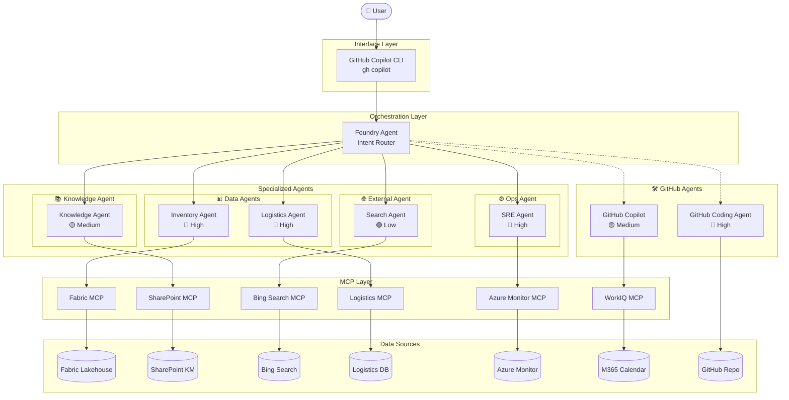
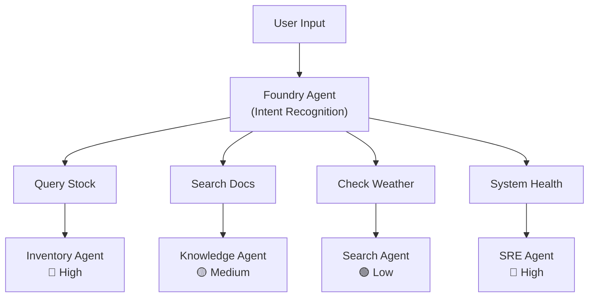

# 🍍 Zava Smart Assistant — Enterprise Incident Response AI Agent

> **Agents League TechConnect — Battle #1: Creative Apps with GitHub Copilot**

Zava is an AI-powered enterprise incident response agent built with the **GitHub Copilot SDK**. It demonstrates how AI agents can orchestrate multiple tools and data sources to handle a cross-regional product outage scenario in real time.

## 🎯 The Scenario

**Zava "101 Pineapple Cake"** — a signature product — is out of stock across Taiwan, Japan, and the US. Zava walks users through the full incident lifecycle: diagnosing the root cause, coordinating fixes, tracking logistics, and generating reports — all through natural conversation in Traditional Chinese.

## ✨ Demo Phases & Technology Overview

| Phase | Demo | Agent / Tool | MCP | Data Source |
|-------|------|--------------|-----|-------------|
| **Phase 1: Identify** | Demo 1 — Inventory Query | Foundry Agent | Fabric MCP | Fabric Lakehouse (inventory) |
| | Demo 2 — Knowledge Search | Foundry Agent | SharePoint MCP | SharePoint KM docs |
| **Phase 2: Fix** | Demo 3 — Bug Fix | GitHub Coding Agent | — | GitHub Repo (bug code) |
| **Phase 3: Verify** | Demo 4 — Weather & News | Foundry Agent | Bing Search MCP | Bing search results |
| | Demo 5 — Logistics Tracking | Foundry Agent | Logistics MCP | Logistics tracking DB |
| | Demo 6 — System Health | Foundry Agent | Azure Monitor MCP | Azure Logs / Metrics |
| **Phase 4: Report** | Demo 7 — Incident Report | GitHub Copilot | — | Incident context |
| | Demo 8 — Meeting Booking | GitHub Copilot | WorkIQ MCP | M365 Calendar |

### Human-in-the-Loop Governance

Zava implements a **permission escalation** mechanism:

- Starts with regional-only access
- Requests manager approval before accessing cross-region data
- Demonstrates enterprise governance patterns in AI agents

## 🏗️ Architecture

### Architecture Layers

| Layer | Component | Description |
|-------|-----------|-------------|
| **Interface** | GitHub Copilot CLI | Unified developer entry point via `gh copilot` commands |
| **Orchestration** | Foundry Agent | Unified router — dispatches to specialized agents based on intent |
| **Specialized Agents** | 4 categories, 6 agents | Permission-classified, each with specific responsibilities |
| **MCP Layer** | 6 MCP connectors | Standardized protocol connecting to various data sources |
| **Data Layer** | 7 data sources | Internal and external enterprise data |



### 🔐 Agent Permission Model

| Agent Category | Agent Name | Permission | Accessible Resources | Demo |
|----------------|-----------|------------|---------------------|------|
| 📊 Data Agent | Inventory Agent | 🔴 High | Fabric Lakehouse (inventory) | Demo 1 |
| | Logistics Agent | 🔴 High | Logistics DB | Demo 5 |
| 📚 Knowledge Agent | Knowledge Agent | 🟡 Medium | SharePoint internal docs | Demo 2 |
| 🌐 External Agent | Search Agent | 🟢 Low | Bing public search | Demo 4 |
| ⚙️ Ops Agent | SRE Agent | 🔴 High | Azure Monitor Logs/Metrics | Demo 6 |
| 🛠️ GitHub Agent | Coding Agent | 🔴 High | GitHub Repo (write) | Demo 3 |
| 🛠️ GitHub Agent | Copilot | 🟡 Medium | M365 Calendar | Demo 7-8 |

**Why permission-based agent classification?**

1. **Least Privilege** — Each agent only has the minimum permissions needed
2. **Security Isolation** — External agents cannot access internal data
3. **Audit Trail** — Track which agent accessed which resources
4. **Elastic Scaling** — Adding new data sources only requires creating corresponding agents

### Foundry Agent Routing Logic



## 🚀 Getting Started

### Prerequisites

- Python 3.11+
- [GitHub Copilot](https://github.com/features/copilot) subscription
- Node.js (for MCP servers)

### Installation

```bash
# Clone the repository
git clone https://github.com/<your-org>/poc-ai-summit-2026.git
cd poc-ai-summit-2026

# Create virtual environment
python -m venv .venv
source .venv/bin/activate  # macOS/Linux
# .venv\Scripts\activate   # Windows

# Install dependencies
pip install .
```

### Environment Variables

Copy the example file and fill in your credentials:

```bash
cp .env.example .env
```

Required variables:

| Variable | Description |
|----------|-------------|
| `GITHUB_TOKEN` | GitHub Personal Access Token for MCP |

### Running the App

```bash
python console_app.py
# or
zava
```

## 🔌 MCP Integration

This project integrates with **6 MCP (Model Context Protocol) connectors** to connect specialized agents with enterprise data sources:

| MCP | Agent | Data Source | Description |
|-----|-------|-------------|-------------|
| Fabric MCP | Inventory Agent | Fabric Lakehouse | Cross-region inventory queries (TW/JP/US) |
| SharePoint MCP | Knowledge Agent | SharePoint doc library | Internal knowledge management document search |
| Bing Search MCP | Search Agent | Bing Search engine | Real-time public info (weather, news) |
| Logistics MCP | Logistics Agent | Logistics tracking DB | Shipment status and ETA |
| Azure Monitor MCP | SRE Agent | Azure Logs/Metrics | System health monitoring |
| WorkIQ MCP | Copilot | M365 Calendar | Meeting scheduling and calendar availability |

> **Note**: GitHub Coding Agent (Demo 3) operates directly on GitHub Repos without MCP.

### Fallback Design

All MCP-backed tools include graceful degradation — if an MCP server is unavailable, the tool falls back to a pre-authored response, ensuring the demo remains functional offline.

## 🤖 GitHub Copilot Usage

This project leverages **GitHub Copilot** in two distinct roles:

### As the User Interface

- **GitHub Copilot CLI** (`gh copilot`) serves as the unified developer entry point
- Users interact with the full agent ecosystem through natural language commands

### As a Specialized Agent

- **Demo 7** — GitHub Copilot generates incident reports from conversation context
- **Demo 8** — GitHub Copilot integrates with WorkIQ MCP for M365 meeting scheduling

### During Development

- **Copilot Chat** was used for designing the agent routing framework, debugging async streaming patterns, and generating system prompts
- **Copilot Agent Mode** assisted in scaffolding the Foundry Agent integration and MCP client setup
- **Inline suggestions** accelerated writing the YAML frontmatter parser and tool builder

## 📁 Project Structure

```
agents-league-techconnect-2026/
├── console_app.py        # Console CLI entry point
├── pyproject.toml        # Python project config & dependencies
├── requirements.txt      # Pip requirements (mirrors pyproject.toml)
├── .env.example          # Environment variable template
│
├── src/
│   ├── __init__.py
│   ├── agents.py         # Agent definitions & permission model
│   ├── router.py         # Foundry Agent intent router
│   ├── prompts.py        # System prompt (English)
│   ├── skills.py         # SKILL.md loader & parser
│   └── tools.py          # Copilot SDK Tool builder
│
├── tests/                # Automated test suite (pytest)
│   ├── conftest.py       # Shared fixtures & config
│   ├── test_agents.py    # Agent registry & permission tests
│   ├── test_router.py    # Intent classification & routing tests
│   ├── test_skills.py    # SKILL.md parser tests
│   ├── test_tools.py     # Tool builder tests
│   ├── test_mcp.py       # MCP configuration tests
│   └── test_integration.py # End-to-end pipeline tests
│
├── data/                 # Demo data sources
│   ├── customer-complaints/       # Customer complaints
│   │   ├── tw_complaints_jan25.json
│   │   ├── jp_complaints_jan25.json
│   │   └── us_complaints_jan25.json
│   ├── inventory/                 # Inventory data (Fabric)
│   │   ├── tw_supplier_inventory.csv
│   │   ├── jp_supplier_inventory.csv
│   │   └── us_supplier_inventory.csv
│   └── sharepoint-km/             # Knowledge management docs
│       ├── common-issues-faq.md
│       ├── supplier-sync-guide.md
│       └── inventory-troubleshoot.md
│
└── .github/
    └── skills/           # 8 skill definitions (SKILL.md files)
        ├── demo1-fabric-inventory/
        ├── demo2-sharepoint-km/
        ├── demo3-github-bugfix/
        ├── demo4-bing-weather/
        ├── demo5-logistics/
        ├── demo6-azure-health/
        ├── demo7-incident-report/
        └── demo8-meeting-booking/
```

## 📋 How It Works

1. **User Input** — The user issues a command via GitHub Copilot CLI (`gh copilot`)
2. **Intent Recognition** — Foundry Agent analyzes the user's intent and determines which specialized agent to dispatch to
3. **Agent Routing** — The router (`src/router.py`) dispatches to the appropriate agent based on intent category and permission level
4. **Permission Check** — The agent system (`src/agents.py`) validates that the target agent has sufficient permissions for the requested operation
5. **MCP Invocation** — The specialized agent calls the corresponding MCP connector to access its data source
6. **Result Aggregation** — Foundry Agent aggregates the response and replies in natural conversational Chinese

## � Demo

> TODO: Add demo video link and screenshots here before submission.

## �📄 License

This project is original work created for the Agents League TechConnect hackathon.

## 🔗 Links

- [Agents League TechConnect](https://github.com/microsoft/agentsleague-techconnect)
- [GitHub Copilot SDK](https://github.com/github/copilot-sdk)
- [WorkIQ MCP](https://github.com/microsoft/work-iq-mcp)
- [GitHub MCP Server](https://github.com/github/github-mcp-server)

---

[中文版 README](README-zhtw.md)
