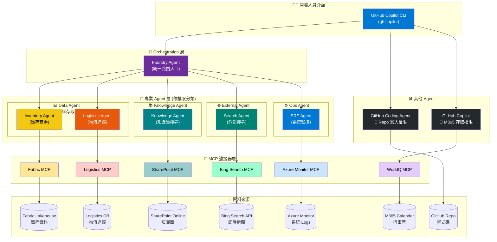

# 📊 AI Summit Demo 完整規劃文件

> **文件類型**: All-in-One Demo Plan  
> **日期**: 2026/01/31  
> **Demo 主題**: Executive Keynote - Zava 101 鳳梨酥跨國客訴事件處理  
> **技術堆疊**: Copilot Studio, Entra Agent ID, Fabric, Foundry, GitHub Copilot, Teams

---

## 1. Demo 建議與完整分析

### 整體劇本優勢

- ✅ 完整展示 Microsoft AI Agent 生態系 (Copilot Studio, Teams, Foundry, Entra, Fabric)
- ✅ 貼近真實企業情境 (跨國客訴、庫存管理、IT 問題處理)
- ✅ 涵蓋 Human-in-the-loop 權限控制
- ✅ 展示 Agent 治理 (Governance) 與安全性

### 潛在風險與建議

| 場景 | 風險 | 建議 |
|------|------|------|
| Scene 2 | Copilot Studio Agent 需真實數據 | 預先載入模擬客訴數據到 Email/SharePoint |
| Scene 5 | Fabric 庫存查詢需實際連接 | 準備 mock data 在 Fabric lakehouse |
| Scene 7 | 多工具串接時間過長 | 預錄部分片段作為 backup |
| Scene 8 | Teams Interpreter 需穩定網路 | 準備 backup 錄製影片 |

---

## 2. 需要準備的資料清單

### 📁 基礎資料 (必備)

```
data/
├── customer-complaints/           # 客訴資料
│   ├── tw_complaints_jan25.json   # 台灣客訴 (1/25後)
│   ├── jp_complaints_jan25.json   # 日本客訴
│   └── us_complaints_jan25.json   # 美國客訴
│
├── inventory/                     # 庫存資料 (Fabric)
│   ├── tw_supplier_inventory.csv
│   ├── jp_supplier_inventory.csv
│   └── us_supplier_inventory.csv  # 美國僅剩 3 盒 → 下午補 300 盒
│
├── sharepoint-km/                 # 知識管理文件
│   ├── common-issues-faq.md       # 常見問題與解法
│   ├── supplier-sync-guide.md     # 供應商資料同步說明
│   └── inventory-troubleshoot.md  # 庫存異常排解
│
├── weather-news/                  # 天氣新聞模擬
│   └── us_weather_blizzard.json   # 美國暴風雪新聞
│
└── logistics/                     # 物流進度
    └── us_shipment_tracking.json  # 預計下午到貨 300 盒
```

### 👥 人員與權限設定

| 角色 | 人員 | Teams 群組 | 權限需求 |
|------|------|-----------|----------|
| 老闆 | Executive | - | - |
| 產品主管 | Product Manager | Incident Response | 開通庫存查詢權限 |
| IT 人員 | IT Operator | Incident Response | 查詢庫存、修 Bug |
| Demo 執行 | Demo Team | 各自角色 | 對應系統存取 |

### 🔧 系統準備

| 系統 | 準備項目 |
|------|----------|
| **Copilot Studio** | 建立 Agent 連接客服信箱、設定應變小組觸發 |
| **Entra Agent ID** | 設定 Agent 身分、權限 policy |
| **Fabric** | 建立 lakehouse 含 TW/JP/US 庫存表 |
| **Foundry** | 設定 SharePoint connector、Bing Search MCP |
| **GitHub** | 準備有 Bug 的 repo、設定 Copilot 存取 |
| **Teams** | 預建群組、設定 Facilitator/Interpreter |

---

## 3. Page 8: Scene 7 Demo 順暢執行方案

這是最複雜的場景，由 Demo Team 執行。

### Demo 架構

```
┌─────────────────────────────────────────────────────────────────┐
│                    Scene 7: Agent 能力展示                        │
├─────────────────────────────────────────────────────────────────┤
│                                                                 │
│  Demo 0 (Presenter A)  Demo 1-8 (Presenter B)                  │
│  ┌─────────────┐       ┌─────────────────────────────────────┐  │
│  │ Entra Agent │       │                                     │  │
│  │ ID Portal   │       │  Fabric → Foundry → GitHub → WorkIQ │  │
│  └─────────────┘       └─────────────────────────────────────┘  │
│                                                                 │
└─────────────────────────────────────────────────────────────────┘
```

### 建議 Demo 順序 (Presenter B 執行)

Demo 分為四個階段，模擬真實事件處理流程：

```
Demo 流程圖:

[開始: IT Operator 說明用 Agent 完成]
         │
═════════════════════════════════════════════════════════════════
                    階段一：確認問題 & 過去如何處理
═════════════════════════════════════════════════════════════════
         │
         ▼
┌─────────────────────────────────┐
│ Demo 1: 查詢 Fabric 庫存          │
│ - Use Foundry Agent + Fabric MCP│
│ - 輸入: 查詢台日美庫存            │
│ - 顯示: TW/JP 正常, US 僅 3 盒   │
│ 📌 確認問題範圍與影響程度          │
└─────────────────────────────────┘
         │
         ▼
┌─────────────────────────────────┐
│ Demo 2: 查詢 SharePoint KM       │
│ - Use Foundry Agent             │
│ - 查詢過去類似問題解法            │
│ - 顯示: 供應商同步延遲是常見問題   │
│ 📌 參考歷史經驗，找出解決方向      │
└─────────────────────────────────┘
         │
═════════════════════════════════════════════════════════════════
                    階段二：記錄 & 修改問題
═════════════════════════════════════════════════════════════════
         │
         ▼
┌─────────────────────────────────┐
│ Demo 3: 修復 Bug                 │
│ - Use GitHub Coding Agent       │
│ - 修復供應商同步 Bug             │
│ - 確認合規 (MDC)                 │
│ 📌 自動修復並確保符合規範          │
└─────────────────────────────────┘
         │
═════════════════════════════════════════════════════════════════
                    階段三：確認修改後成效
═════════════════════════════════════════════════════════════════
         │
         ▼
┌─────────────────────────────────┐
│ Demo 4: 查詢天氣新聞              │
│ - Use Foundry + Bing Search MCP │
│ - 查詢美國東岸天氣               │
│ - 顯示: 美國暴風雪               │
│ 📌 了解外部因素影響               │
└─────────────────────────────────┘
         │
         ▼
┌─────────────────────────────────┐
│ Demo 5: 查詢物流進度              │
│ - Use Foundry + Logistics MCP   │
│ - 查詢美國供應商補貨進度          │
│ - 顯示: 下午補貨 300 盒          │
│ 📌 確認補貨時程                   │
└─────────────────────────────────┘
         │
         ▼
┌─────────────────────────────────┐
│ Demo 6: 檢查系統健康度            │
│ - Use Foundry + Azure MCP       │
│ - 檢查 US 系統健康度             │
│ - 收集 logs                     │
│ 📌 驗證修復成效                   │
└─────────────────────────────────┘
         │
═════════════════════════════════════════════════════════════════
                    階段四：撰寫事件報告 & 後續追蹤
═════════════════════════════════════════════════════════════════
         │
         ▼
┌─────────────────────────────────┐
│ Demo 7: 事件報告                 │
│ - Use GitHub Copilot            │
│ - 整理事件來龍去脈               │
│ - 產生報告草稿                   │
│ 📌 自動彙整完整報告               │
└─────────────────────────────────┘
         │
         ▼
┌─────────────────────────────────┐
│ Demo 8: 會議預約                 │
│ - Use GitHub Copilot + WorkIQ   │
│ - 查詢 Almond 時間              │
│ - 發送會議邀請                   │
│ 📌 安排後續追蹤會議               │
└─────────────────────────────────┘
```

---

### 階段一：確認問題 & 過去如何處理

**目標**：快速掌握問題範圍，並參考歷史經驗

```bash
# Demo 1: 查詢庫存 (Foundry Agent + Fabric MCP)
> 查詢台灣、日本、美國供應商的 101 造型鳳梨酥庫存

# Demo 2: 查詢知識庫 (Foundry Agent)
> 搜尋 SharePoint 知識庫，找出供應商資料同步延遲的解決方法
```

---

### 階段二：記錄 & 修改問題

**目標**：修復問題並確保符合規範

```bash
# Demo 3: 修復 Bug (GitHub Coding Agent)
# 在 GitHub 上 assign issue 給 Copilot，自動修復並提交 PR
> @copilot 修復供應商同步的 Bug，確保符合 MDC 規範
```

---

### 階段三：確認修改後成效

**目標**：驗證修復成果，確認外部因素

```bash
# Demo 4: 查詢天氣 (Foundry + Bing MCP)
> 查詢美國東岸最近的天氣新聞

# Demo 5: 查詢物流 (Foundry + Logistics MCP)
> 透過物流系統查詢美國供應商的補貨進度

# Demo 6: 檢查系統 (Foundry + Azure MCP)
> 檢查美國端系統狀態，收集最近的錯誤日誌
```

---

### 階段四：撰寫事件報告 & 後續追蹤

**目標**：產生報告，安排追蹤會議

```bash
# Demo 7: 產生報告 (GitHub Copilot)
$ gh copilot "整理這次事件的來龍去脈，產生報告草稿"

# Demo 8: 預約會議 (GitHub Copilot + WorkIQ)
$ gh copilot "查詢 Almond 今天下午的可用時間，安排 30 分鐘會議"
```

---

### 📊 Demo 使用技術總覽表

| 階段 | Demo | Agent / Tool | MCP | 資料來源 |
|------|------|--------------|-----|----------|
| **階段一：確認問題** | Demo 1 | Foundry Agent | Fabric MCP | Fabric Lakehouse (庫存表) |
| | Demo 2 | Foundry Agent | SharePoint MCP | SharePoint KM 文件 |
| **階段二：修改問題** | Demo 3 | GitHub Coding Agent | - | GitHub Repo (Bug 程式碼) |
| **階段三：確認成效** | Demo 4 | Foundry Agent | Bing Search MCP | Bing 搜尋結果 |
| | Demo 5 | Foundry Agent | Logistics MCP | 物流追蹤 DB |
| | Demo 6 | Foundry Agent | Azure Monitor MCP | Azure Logs / Metrics |
| **階段四：報告追蹤** | Demo 7 | GitHub Copilot | - | 事件上下文 |
| | Demo 8 | GitHub Copilot | WorkIQ MCP | M365 Calendar |

---

### 🏗️ Demo 完整架構圖



#### 架構說明

| 層級 | 組件 | 說明 |
|------|------|------|
| **介面層** | GitHub Copilot CLI | 開發人員統一入口，透過 `gh copilot` 指令與各 Agent 互動 |
| **Orchestration 層** | Foundry Agent | 統一路由入口，根據意圖分派給適合的專業 Agent |
| **專業 Agent 層** | 4 類專業 Agent | 依權限分類，各司其職 |
| **其他 Agent** | GitHub 相關 Agent | 程式碼修復與 M365 整合 |
| **MCP 層** | 6 個 MCP 連接器 | 標準化協議連接各種資料來源 |
| **資料層** | 7 種資料來源 | 企業內外部資料 |

#### 🔐 Agent 權限分類表

| Agent 類別 | Agent 名稱 | 權限等級 | 可存取資源 | Demo |
|------------|-----------|----------|-----------|------|
| **📊 Data Agent** | Inventory Agent | 🔴 高 | Fabric Lakehouse (庫存資料) | Demo 1 |
| | Logistics Agent | 🔴 高 | 物流系統 DB | Demo 5 |
| **📚 Knowledge Agent** | Knowledge Agent | 🟡 中 | SharePoint 內部文件 | Demo 2 |
| **🌐 External Agent** | Search Agent | 🟢 低 | Bing 公開搜尋 | Demo 4 |
| **⚙️ Ops Agent** | SRE Agent | 🔴 高 | Azure Monitor Logs/Metrics | Demo 6 |
| **🛠️ GitHub Agent** | Coding Agent | 🔴 高 | GitHub Repo (寫入) | Demo 3 |
| **🛠️ GitHub Agent** | Copilot | 🟡 中 | M365 Calendar | Demo 7-8 |

#### 為什麼要依權限分類 Agent？

1. **最小權限原則**：每個 Agent 只擁有完成任務所需的最小權限
2. **安全隔離**：External Agent 無法存取內部資料
3. **審計追蹤**：可追蹤哪個 Agent 存取了哪些資源
4. **彈性擴展**：新增資料來源時，只需建立對應權限的 Agent

#### Foundry Agent 路由邏輯

```
使用者輸入 → Foundry Agent (意圖辨識)
                    │
    ┌───────────────┼───────────────┬───────────────┐
    ▼               ▼               ▼               ▼
"查詢庫存"      "搜尋文件"      "查天氣"       "檢查系統"
    │               │               │               │
    ▼               ▼               ▼               ▼
Inventory       Knowledge        Search           SRE
Agent           Agent            Agent           Agent
(高權限)        (中權限)         (低權限)        (高權限)
```

---

### 🔌 MCP 連接器清單

| MCP 名稱 | 連接目標 | 用途 |
|----------|----------|------|
| Fabric MCP | Microsoft Fabric | 查詢 Lakehouse 庫存資料 |
| SharePoint MCP | SharePoint Online | 查詢內部知識庫文件 |
| Bing Search MCP | Bing Search API | 查詢即時新聞與天氣 |
| Logistics MCP | 物流系統 DB | 查詢貨運進度 |
| Azure Monitor MCP | Azure Monitor | 查詢系統健康度與 Logs |
| WorkIQ MCP | Microsoft 365 | 查詢行事曆、安排會議 |

---

### 📁 資料準備清單

| 資料類型 | 檔案/位置 | 內容說明 |
|----------|-----------|----------|
| 庫存資料 | Fabric Lakehouse | TW/JP/US 供應商庫存 (US 僅 3 盒) |
| KM 文件 | SharePoint | 供應商同步延遲解決方法 |
| Bug 程式碼 | GitHub Repo | 有 Bug 的供應商同步程式 |
| 天氣新聞 | Bing (即時) | 美國暴風雪新聞 |
| 物流資料 | Logistics DB | 美國補貨 300 盒，下午到達 |
| 系統 Logs | Azure Monitor | US 系統健康狀態 |
| 行事曆 | M365 Calendar | Almond 可用時間 |
