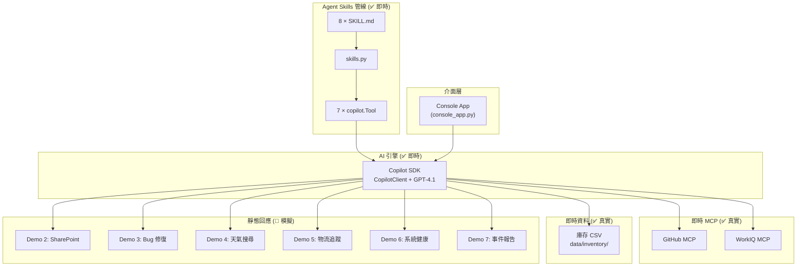

# Zava 智慧助理 — 技術摘要

> 簡報素材用技術文件 — Agents League TechConnect 2026

---

## 1. 問題陳述

### 痛點

企業面對跨國事件時，傳統處理方式存在以下問題：

- 需要在 6 個以上的系統之間手動切換（庫存、工單、知識庫、監控等）
- 跨區域資料收集緩慢，各區存取權限不同
- 缺乏統一的根因分析視野
- 報告產生與後續會議協調耗時費力

### 解決方案

**Zava 智慧助理** — 將整個事件回應流程統一到單一對話介面中，基於 **GitHub Copilot SDK** 搭配 MCP（Model Context Protocol）整合，透過 Copilot SDK 的 **Agent Skills** 機制驅動全部 8 個技能。

---

## 2. 核心技術模式：Copilot SDK Agent Skills

> **這是整個應用程式的核心機制。**

系統使用 Copilot SDK 的 **Agent Skills** 功能，將人類可讀的 Markdown 檔案轉換為可執行的工具：

```
.github/skills/demo{1-8}-*/SKILL.md
    → src/skills.py（YAML frontmatter 解析器）
    → src/tools.py（轉換為 copilot.Tool 物件）
    → CopilotClient.create_session(tools=[...])
    → GPT-4.1 在執行時決定呼叫哪個工具
```

### Copilot SDK 提供的能力

| 能力 | 我們的用法 |
|------|-----------|
| `CopilotClient` 工作階段管理 | 單一工作階段含 GPT-4.1 + 工具 + MCP 伺服器 |
| `Tool` 物件註冊 | 從 SKILL.md 檔案建構 7 個工具 |
| MCP 伺服器整合 | 2 個即時 HTTP MCP（GitHub + WorkIQ）註冊於工作階段 |
| 串流事件回呼 | 透過 `SessionEventType.ASSISTANT_MESSAGE_DELTA` 逐字回應 |
| 工具執行事件 | `TOOL_EXECUTION_START` / `TOOL_EXECUTION_COMPLETE` 用於記錄 |
| LLM 驅動路由 | GPT-4.1 讀取系統提示詞決定工具選擇（無需手動路由器） |

---

## 3. 架構總覽

### 系統分層



### 資料流程

```
使用者訊息
    → console_app.py 擷取輸入
    → CopilotClient.send_and_wait(prompt)
    → GPT-4.1 根據系統提示詞選擇工具
    → Tool handler 執行：
        ├── Demo 1: 即時 CSV → Markdown 庫存報表
        ├── Demo 8: 重導 → WorkIQ MCP 真實呼叫
        └── Demo 2-7: SKILL.md 靜態回應
    → LLM 以自然語言解讀並摘要
    → 回應逐字串流至 Console
```

---

## 4. 即時功能 vs 模擬展示 — 完整分析

### ✅ 即時元件（執行時完整功能）

| 元件 | 實作方式 | 檔案 |
|------|----------|------|
| Copilot SDK 引擎 | `CopilotClient` 工作階段、串流、工具呼叫 | `console_app.py` |
| Agent Skills 管線 | SKILL.md → 解析 → `copilot.Tool` | `src/skills.py`、`src/tools.py` |
| 系統提示詞與治理 | 權限升級、MCP 路由規則 | `src/prompts.py` |
| GitHub MCP | HTTP MCP（`api.githubcopilot.com/mcp/`） | `console_app.py` session 設定 |
| WorkIQ MCP | HTTP MCP（`workiq.microsoft.com/mcp/`） | `console_app.py` session 設定 |
| Demo 1 庫存資料 | 真實 CSV 檔案 → Markdown 報表 | `src/inventory_data.py`、`data/inventory/*.csv` |
| Agent 註冊表與權限 | 7 個 Agent 含權限模型 | `src/agents.py` |
| 意圖路由器 | 關鍵字分類（獨立模組） | `src/router.py` |
| 自動化測試 | 181 項測試，100% 通過 | `tests/` |

### 🔶 模擬元件（預先撰寫的靜態回應）

| 元件 | 實際行為 | 模擬原因 |
|------|----------|----------|
| Fabric MCP | 讀取本地 CSV，非真實 Fabric | Demo 環境無即時 Fabric Lakehouse |
| SharePoint MCP | 回傳 SKILL.md 文字 | 無即時 SharePoint 站台 |
| Bing Search MCP | 回傳 SKILL.md 文字 | 離線 Demo 穩定性 |
| Logistics MCP | 回傳 SKILL.md 文字 | 無即時物流 DB |
| Azure Monitor MCP | 回傳 SKILL.md 文字 | 未連接即時 Azure Monitor |
| Demo 2-7 回應 | SKILL.md 預先撰寫的 Markdown | MCP 後端不可用 |
| 自訂 Agent 切換 | 僅顯示資訊，未更換工作階段 | 功能預留位置 |
| 權限升級 | 僅系統提示詞指令 | 無程式碼層級檢查 |
| Playwright/Filesystem MCP | 在設定中，未註冊於工作階段 | Demo 流程不需要 |

### 🔶 僅供參考（未整合）

| 元件 | 說明 |
|------|------|
| `ref/01_inventory_agent_sample.py` | 透過 `azure-ai-projects` SDK 的獨立 Foundry Agent |
| `ref/00_env_check.py` | Azure 憑證/連線驗證器 |
| `ref/agent_utils.py` | Foundry 腳本共用工具 |

---

## 5. 核心設計決策

### 5.1 Copilot SDK 作為唯一執行引擎

**為什麼**：不自建 Agent 框架，直接使用 Copilot SDK 作為統一 AI 執行時。

- **工具呼叫** — SDK 處理 LLM → 工具分派 → 回應彙整
- **MCP 整合** — 即時 MCP 伺服器直接註冊於工作階段設定
- **串流** — 內建事件回呼即時顯示回應
- **系統提示詞** — 管控工具選擇、權限規則、回應行為

**實作**（`console_app.py`）：
```python
client = CopilotClient()
session = await client.create_session({
    "model": "gpt-4.1",
    "streaming": True,
    "tools": tools,  # 從 SKILL.md 建構的 7 個 copilot.Tool
    "system_message": {"content": SYSTEM_MESSAGE},
    "mcp_servers": {
        "workiq": {"type": "http", "url": "https://workiq.microsoft.com/mcp/", "tools": ["*"]},
        "github": {"type": "http", "url": "https://api.githubcopilot.com/mcp/", "tools": ["*"]},
    },
})
```

### 5.2 技能即 Markdown 架構（Skill-as-Markdown）

**為什麼**：技能定義在 SKILL.md 檔案，使用 YAML frontmatter，而非寫死在 Python 函式中。

**管線**：
```
.github/skills/demo1-fabric-inventory/SKILL.md
    → skills.py: _parse_frontmatter() + _extract_triggers() + _extract_response()
    → Skill dataclass（name, description, triggers, response_content, demo_id）
    → tools.py: build_tools() → copilot.Tool(name, description, parameters, handler)
```

**好處**：
- **非開發者可編輯** — 產品經理可直接修改技能回應
- **版本控制友善** — 每個技能是獨立檔案，容易 diff 與審查
- **自我文件化** — 技能檔案本身就是文件
- **熱插拔** — 新增/移除資料夾即可增減技能

### 5.3 LLM 驅動路由（非程式碼驅動）

**為什麼**：系統提示詞告訴 GPT-4.1 有哪些工具及何時使用。LLM 在執行時決定路由。

**關鍵洞察**：`src/router.py`（關鍵字意圖路由器）作為可測試的獨立模組（50 項測試），但**未在 `console_app.py` 中呼叫**。LLM 根據 `src/prompts.py` 中的系統提示詞處理所有路由決策。

### 5.4 MCP 雙模式 + 即時 CSV 資料

**為什麼**：MCP 提供標準化協議連接外部資料源，但現場 Demo 需要穩定性。

**三層資料架構**：
1. **即時 MCP**（GitHub, WorkIQ）— SDK 工作階段中的真實 HTTP 端點
2. **即時 CSV**（Demo 1）— `src/inventory_data.py` 讀取 `data/inventory/*.csv` 含異常偵測
3. **靜態降級**（Demo 2-7）— SKILL.md 預先撰寫的回應

**即時 CSV 實作**（`src/tools.py`）：
```python
use_live_csv = skill.name == "fabric-inventory-query"
if use_live_csv:
    report = generate_inventory_report()  # 讀取 CSV 檔案
    return {"textResultForLlm": report, "resultType": "success"}
```

### 5.5 權限升級（提示詞驅動治理）

**為什麼**：展示企業治理模式，無需程式碼層面強制。

**流程**（完全在系統提示詞中）：
```
使用者要求跨區域資料
    → LLM 拒絕：「我僅具備區域檢視權限」
    → LLM 建議：「請聯繫主管開啟臨時權限」
    → 使用者確認：「已經開通了」
    → LLM 以完整權限執行
    → 權限限於本次工作階段
```

---

## 6. 八大技能 — 詳細分解

| 階段 | 技能 | Tool Handler | MCP | 資料狀態 |
|------|------|-------------|-----|----------|
| **診斷** | 1. 庫存查詢 | ✅ `generate_inventory_report()` → 即時 CSV | fabric-mcp 🔶 | ✅ 即時 |
| | 2. 知識庫搜尋 | 🔶 靜態 SKILL.md 回應 | sharepoint-mcp 🔶 | 🔶 靜態 |
| **修復** | 3. Bug 修復代理 | 🔶 靜態 SKILL.md 回應 | — | 🔶 靜態 |
| **驗證** | 4. 天氣搜尋 | 🔶 靜態 SKILL.md 回應 | bing-search-mcp 🔶 | 🔶 靜態 |
| | 5. 物流追蹤 | 🔶 靜態 SKILL.md 回應 | logistics-mcp 🔶 | 🔶 靜態 |
| | 6. 系統健康度 | 🔶 靜態 SKILL.md 回應 | azure-monitor-mcp 🔶 | 🔶 靜態 |
| **報告** | 7. 事件報告 | 🔶 靜態 SKILL.md 回應 | — | 🔶 靜態 |
| | 8. 會議預約 | ✅ 重導至即時 WorkIQ MCP | workiq-mcp ✅ | ✅ 即時 |

> 技能 2-7 使用 `LIVE_MCP_SKILLS` 字典 — 當真實 MCP 伺服器上線後，只需增加條目即可從靜態切換至即時。

---

## 7. 技術棧

| 元件 | 技術 | 即時/模擬 |
|------|------|-----------|
| AI 執行引擎 | GitHub Copilot SDK（`CopilotClient`） | ✅ 即時 |
| LLM | GPT-4.1 | ✅ 即時 |
| 工具管線 | `src/skills.py` → `src/tools.py` → `copilot.Tool` | ✅ 即時 |
| 即時 MCP | GitHub MCP + WorkIQ MCP（HTTP） | ✅ 即時 |
| 庫存資料 | `src/inventory_data.py` → CSV 檔案 | ✅ 即時 |
| Agent 框架 | `src/agents.py`（7 Agent + 權限模型） | ✅ 中繼資料 |
| 意圖路由器 | `src/router.py`（關鍵字式） | ✅ 獨立模組 |
| 系統提示詞 | `src/prompts.py` | ✅ 即時 |
| 命令列介面 | Python asyncio（`console_app.py`） | ✅ 即時 |
| 技能定義 | YAML + Markdown（`.github/skills/`） | ✅ 即時 |
| 靜態 MCP | Fabric、SharePoint、Bing、Logistics、Azure Monitor | 🔶 中繼資料標籤 |
| 自訂 Agent | `config/agent.json`（3 個 Agent） | 🔶 僅顯示 |
| 設定管理 | python-dotenv | ✅ 即時 |
| 測試 | pytest（181 項測試） | ✅ 即時 |
| 程式語言 | Python 3.11+ | ✅ |

---

## 8. 關鍵差異化

### 與傳統聊天機器人比較

| 面向 | 傳統聊天機器人 | Zava |
|------|--------------|------|
| 工具協調 | 規則式路由 | LLM 決定呼叫哪些工具 |
| 多工具串接 | 每次只能一個工具 | 單次對話中串接多個工具 |
| 治理機制 | 角色權限控制 | 提示詞驅動的權限升級 |
| 技能管理 | 需修改程式碼 | 編輯 Markdown 檔案 |
| 資料來源 | 直接 API 呼叫 | MCP 協議 + SKILL.md 降級 |

### 與直接使用 LLM API 比較

| 面向 | 直接 API | Zava |
|------|----------|------|
| 工具呼叫 | 手動實作 | Copilot SDK 處理路由 |
| 串流 | 自行建構 | 內建事件回呼 |
| MCP 整合 | 不可用 | SDK 原生 MCP 支援 |
| 上下文管理 | Token 計算 | 工作階段式 |
| 擴展性 | 需重構 API | 放入 SKILL.md 即可 |

---

## 9. 創新亮點

1. **Copilot SDK Agent Skills 作為核心模式** — 整個系統圍繞「Markdown 技能檔案轉換為 `copilot.Tool` 物件」建構，展示 SDK 在企業情境中的可擴展性

2. **多 Agent 權限模型** — 7 個專業 Agent 依權限等級分類（🔴 高 / 🟡 中 / 🟢 低），在 Agent 生態系中落實最小權限原則

3. **技能即 Markdown（Skill-as-Markdown）** — 創新模式，Agent 能力以人類可讀的 Markdown 檔案定義，讓非開發者也能參與 Agent 設定

4. **提示詞驅動治理（Prompt-Driven Governance）** — 權限升級完全透過系統提示詞設計實現，展示 LLM 行為約束可落實真實企業政策

5. **MCP 雙模式** — 2 個即時 MCP 伺服器（GitHub + WorkIQ）+ 5 個靜態標籤含離線降級，解決現場 Demo 穩定性挑戰

6. **即時 CSV 資料管線** — Demo 1 讀取真實 CSV 庫存資料含異常偵測，展示從靜態技能到即時資料整合的路徑

7. **多階段事件工作流程** — 8 個技能組織為 4 個邏輯階段（診斷 → 修復 → 驗證 → 報告），展示 AI Agent 如何引導使用者完成複雜多步驟流程

8. **透明的即時/模擬標示** — 每個元件明確標示為即時或模擬，展示 POC/Demo 專案的誠實工程實踐

---

## 10. Demo 情境走訪

```
階段一：診斷（技能 1-2）
├── 「查詢台灣、日本、美國庫存」
│   → 權限不足 → 主管核准 → 跨區域查詢
│   → ✅ Demo 1：即時 CSV 資料來自 data/inventory/
│   → 結果：台灣 3,270 / 日本 700 正常，美國僅 3 盒 ⚠️ 危急
├── 「為什麼網站顯示缺貨？」
│   → 🔶 Demo 2：靜態 SKILL.md 回應
│   → 知識庫找到過去同步延遲事件
│
階段二：修復（技能 3）
├── 「幫我 debug 並修復」
│   → 🔶 Demo 3：靜態 SKILL.md 回應
│   → GitHub Agent：API timeout 5s→30s、新增重試、完善錯誤處理
│   → PR 已建立、CI 通過
│
階段三：驗證（技能 4-6）
├── 「美國為什麼庫存這麼少？」
│   → 🔶 Demo 4：靜態天氣回應
│   → 🔶 Demo 5：靜態物流回應
│   → 天氣：美國東岸暴風雪 → 物流延誤
│   → 物流：300 盒今天下午到達
├── 「確保美國端同步也沒問題」
│   → 🔶 Demo 6：靜態健康度回應
│   → 系統健康度：全綠，同步率 87.3%→99.8%
│
階段四：報告（技能 7-8）
├── 「整理事件報告，並約會議」
│   → 🔶 Demo 7：靜態報告範本
│   → ✅ Demo 8：即時 WorkIQ MCP → 真實 M365 行事曆資料
│   → 報告自動產生，會議已預約：下午 3:00
│
結果：一次對話完成整起事件處理
```

---

## 11. 提交合規檢查

| 需求項目 | 狀態 |
|----------|------|
| GitHub Copilot 使用文件 | ✅ |
| 創意應用、獨特概念 | ✅ |
| MCP 整合（GitHub + WorkIQ 即時） | ✅ |
| 無硬編碼憑證 | ✅ |
| 無 PII 或機密資料 | ✅ |
| 公開 Repository + README | ✅ |
| 即時/模擬明確標示 | ✅ |
| 自動化測試套件（181 項） | ✅ |
| Demo 素材 | ⏳ 待補 |
| 原創作品 | ✅ |
