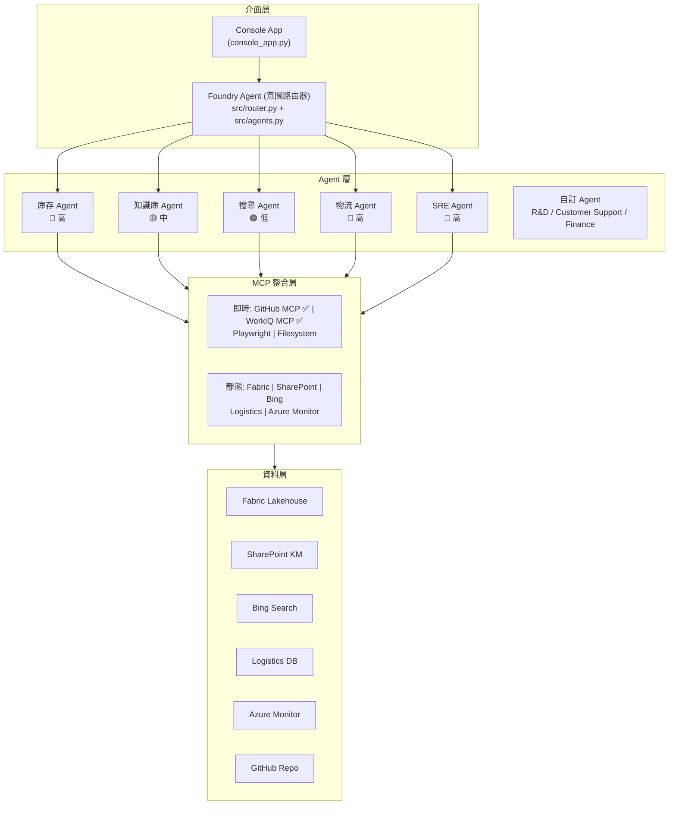

# Zava 智慧助理 — 技術摘要

> 簡報素材用技術文件 — Agents League TechConnect 2026

---

## 1. 問題陳述

### 痛點

企業面對跨國事件時，傳統處理方式存在以下問題：

- 需要在 6 個以上的系統之間手動切換（庫存、工單、知識庫、監控等）
- 跨區域資料收集緩慢，各區存取權限不同
- 缺乏統一的根因分析視野
- 報告產生與後續會議協調耗時費力

### 解決方案

**Zava 智慧助理** — 將整個事件回應流程統一到單一對話介面中，基於 GitHub Copilot SDK 搭配 MCP（Model Context Protocol）整合，包含 **5 類 7 個專業 Agent**、**3 個可切換自訂 Agent**、以及 **8 個 MCP 連接器**，一個助理解決所有問題。

---

## 2. 架構總覽

### 系統分層



另包含 GitHub Agent（Coding Agent + Copilot）與 Foundry 路由的 Agent 並行運作。
Console App 另提供 3 個可切換的自訂 Agent（R&D / Customer Support / Finance）。

### 資料流程

```
使用者訊息
    → Console App 擷取輸入
    → Foundry Agent 分類意圖 (src/router.py)
    → 根據意圖與權限路由至專業 Agent
    → Agent 透過 MCP 連接器存取資料來源
    → 結果彙整並以自然對話摘要
    → 逐字串流回傳至介面
```

---

## 3. 核心設計決策

### 3.1 Foundry Agent 作為編排器

**為什麼**：相較於单一 Agent 平面架構，我們使用 Foundry Agent 作為中央編排器，將意圖路由至專業 Agent。

- **意圖式路由** — Foundry Agent 分類使用者輸入並分派至正確的 Agent
- **權限隔離** — 每個 Agent 有明確的權限等級（🔴 高 / 🟡 中 / 🟢 低）
- **審計追蹤** — 每個路由決策都帶有信心度分數紀錄
- **彈性擴展** — 新增 Agent 無需修改現有的

**實作範例**：
```python
from src.router import FoundryRouter

router = FoundryRouter()
agent, intent, confidence = router.route(user_input)
# → (InventoryAgent, INVENTORY_QUERY, 0.85)
```

### 3.2 技能即 Markdown 架構

**為什麼**：技能定義在 `SKILL.md` 檔案中，使用 YAML frontmatter，而非寫死在 Python 函式中。

**好處**：
- **非開發者可編輯** — 產品經理可直接修改技能回應內容
- **版本控制友善** — 每個技能是獨立檔案，容易 diff 與審查
- **自我文件化** — 技能檔案本身就是文件
- **熱插拔** — 新增/移除資料夾即可增減技能

**結構範例**：
```yaml
---
name: fabric-inventory-query
description: '查詢 Fabric Lakehouse 中的庫存資訊'
---
## 觸發條件
- 查詢庫存
- 產品庫存狀況
## 預設回應
<Markdown 格式的回應內容>
```

### 3.3 Foundry Agent 實作（Demo 1 庫存查詢）

**為什麼**：將靜態技能回應升級為真實 Azure AI Foundry Agent，展示從 Demo 原型到 Production Agent 的實際路徑。

**實作**（`ref/02_inventory_agent.py`）：
- 使用 `azure-ai-projects` GA SDK (v1.0.0) 建立 Foundry Agent
- 庫存資料（TW/JP/US 三區）內嵌於 Agent 指令中，模擬 Fabric Lakehouse 查詢結果
- 兩種對話模式：
  - **Responses API**：`openai.responses.create()` — 輕量、無狀態
  - **Agent threads**：`agents.create_agent()` + `create_thread_and_process_run()` — 持久性 Agent
- 內建異常偵測邏輯：自動標記美國區庫存 ⚠️ 危急 / ❌ 斷貨

**已驗證結果**（2026-02-12）：
```
🔍 全區域庫存查詢  → TW 3,270 / JP 700 / US 3   ⏱️ ~8s
⚠️ 異常偵測        → 美國 NY 斷貨 5 天           ⏱️ ~6s
🚚 補貨計畫        → 300 盒空運 2/1 PM 到達      ⏱️ ~8s
```

### 3.4 MCP 整合 + 優雅降級

**為什麼**：MCP 提供標準化協議連接外部資料來源，但現場 Demo 需要穩定性。

**設計**：
- **即時連線** — GitHub MCP 與 WorkIQ MCP 在 Session 層級註冊，提供真實即時資料
- **靜態降級** — Fabric、SharePoint、Bing、Logistics、Azure Monitor MCP 透過 SKILL.md 提供預設回應
- 另包含 Playwright MCP（瀏覽器自動化）與 Filesystem MCP（檔案存取）
- `src/tools.py` 中的 `LIVE_MCP_SKILLS` 字典控制哪些技能走即時 MCP、哪些走靜態回應
- 此雙模式確保 Demo 離線可運作，同時展示真實 MCP 能力

### 3.5 權限升級（Human-in-the-Loop）

**為什麼**：展示企業治理模式 — Agent 不應擁有無限制的存取權限。

**流程**：
```
使用者要求跨區域資料
    → Agent 拒絕：「我僅具備區域檢視權限」
    → Agent 建議：「請聯繫主管開啟臨時權限」
    → 使用者確認：「已經開通了」
    → Agent 以完整權限執行
    → 權限限於本次工作階段（模擬 24 小時）
```

此機制完全透過系統提示詞實現，非程式碼層面 — 展示 LLM 行為約束如何落實企業治理政策。

---

## 4. 八大技能 — 詳細分解

| 階段 | 技能 | 後端 | MCP | 用途 |
|------|------|------|-----|------|
| **診斷** | 1. 庫存查詢 ✅ | Azure AI Foundry Agent (已實作) | Fabric MCP | 辨識哪些區域受影響 |
| | 2. 知識庫搜尋 | SharePoint | SharePoint MCP | 尋找過去類似事件模式 |
| **修復** | 3. Bug 修復代理 | GitHub Coding Agent | — | 自動分析與修復根因程式碼 |
| **驗證** | 4. 天氣搜尋 | Bing Search | Bing Search MCP | 確認外部因素（天氣、物流） |
| | 5. 物流追蹤 | Logistics DB | Logistics MCP | 確認出貨 ETA |
| | 6. 系統健康度 | Azure Monitor | Azure Monitor MCP | 驗證修復成效 |
| **報告** | 7. 事件報告 | GitHub Copilot | — | 產生完整事件報告 |
| | 8. 會議預約 | WorkIQ / M365 | WorkIQ MCP | 排程追蹤會議 |

---

## 5. 技術棧

| 元件 | 技術 | 用途 |
|------|------|------|
| AI 執行引擎 | GitHub Copilot SDK | 工作階段管理、工具呼叫、串流 |
| Foundry Agent Service | Azure AI Foundry + `azure-ai-projects` SDK | Demo 1 庫存 Agent 實作（已驗證） |
| OpenAI Responses API | `openai.responses.create()` | Foundry Agent 對話（輕量模式） |
| 編排器 | Foundry Agent | 意圖路由、Agent 分派、權限檢查 |
| Agent 框架 | src/agents.py | 7 個 Agent 定義 + 權限模型 |
| 自訂 Agent | console_app.py | 3 個可切換 Agent（R&D / Support / Finance） |
| 意圖路由器 | src/router.py | 關鍵字意圖分類 |
| LLM | GPT-4.1 | 意圖理解、回應生成 |
| 網頁介面 | Chainlit (app.py) | 含串流支援的聊天介面 |
| 命令列介面 | Python asyncio (console_app.py) | 終端機介面，含 /skills、/mcp、/agent 指令 |
| 技能定義 | YAML + Markdown | 宣告式技能設定 |
| MCP Client（即時） | GitHub MCP, WorkIQ MCP, Playwright, Filesystem | 即時外部服務整合 |
| MCP Client（靜態） | Fabric, SharePoint, Bing, Logistics, Az Monitor | SKILL.md 降級模式 |
| 設定管理 | python-dotenv | 環境變數管理 |
| 程式語言 | Python 3.11+ | async/await、型別提示 |

---

## 6. 關鍵差異化

### 與傳統聊天機器人比較

| 面向 | 傳統聊天機器人 | Zava |
|------|--------------|------|
| 工具協調 | 規則式路由 | LLM 決定呼叫哪些工具 |
| 多工具串接 | 每次只能一個工具 | 單次對話中串接多個工具 |
| 治理機制 | 角色權限控制 | AI 驅動的權限升級 |
| 技能管理 | 需修改程式碼 | 編輯 Markdown 檔案 |
| 資料來源 | 直接 API 呼叫 | MCP 協議抽象層 |

### 與直接使用 LLM API 比較

| 面向 | 直接 API | Zava |
|------|----------|------|
| 工具呼叫 | 手動實作 | Copilot SDK 處理路由 |
| 串流 | 自行建構 | 內建事件回呼 |
| 上下文管理 | Token 計算 | 工作階段式 |
| 擴展性 | 需重構 API | 放入 SKILL.md 即可 |

---

## 7. 創新亮點

1. **多 Agent 權限模型** — 7 個專業 Agent + 3 個自訂 Agent 依權限等級分類（🔴 高 / 🟡 中 / 🟢 低），在 Agent 生態系中落實最小權限原則

2. **Foundry Agent 編排** — 中央化意圖路由器分派至專業 Agent，展示企業級 Agent 協調模式

3. **自訂 Agent 切換** — Console App 支援透過 `/agent` 指令切換至 R&D / Customer Support / Finance Agent，展示「同一 SDK 基座、不同領域」的彈性

4. **技能即 Markdown（Skill-as-Markdown）** — 創新的模式，Agent 能力以人類可讀的 Markdown 檔案定義，讓非開發者也能參與 Agent 設定

5. **提示詞驅動治理（Prompt-Driven Governance）** — 權限升級完全透過系統提示詞設計實現，展示 LLM 行為約束可落實真實企業政策

6. **MCP 雙模式（MCP Dual-Mode）** — 8 個 MCP 連接器（2 個即時 + 6 個靜態）搭配離線降級，解決現場 Demo 穩定性挑戰、同時保留真實 MCP 展示

7. **多階段事件工作流程** — 8 個技能組織為 4 個邏輯階段（診斷 → 修復 → 驗證 → 報告），展示 AI Agent 如何引導使用者完成複雜的多步驟流程

7. **Foundry Agent 實作（Demo 1）** — 庫存查詢 Agent 已透過 Azure AI Foundry Agent Service 實作並驗證，使用 `azure-ai-projects` GA SDK + OpenAI Responses API，展示從 Copilot SDK 靜態技能到真實 Foundry Agent 的演進路徑

---

## 8. Demo 情境走訪

```
階段一：診斷（技能 1-2）✅ Demo 1 已實作為真實 Foundry Agent
├── 「查詢台灣、日本、美國庫存」
│   → 權限不足 → 主管核准 → 跨區域查詢
│   → Foundry Agent (GPT-4.1) 回傳即時庫存表
│   → 結果：台灣 3,270 盒/日本 700 盒正常，美國僅剩 3 盒
├── 「為什麼網站顯示缺貨？」
│   → 知識庫找到過去同步延遲事件
│
階段二：修復（技能 3）
├── 「幫我 debug 並修復」
│   → GitHub Agent：API timeout 5s→30s、新增重試、完善錯誤處理
│   → PR 已建立、CI 通過、MDC 合規
│
階段三：驗證（技能 4-6）
├── 「美國為什麼庫存這麼少？」
│   → 天氣：美國東岸暴風雪 → 物流延誤
│   → 物流：300 盒今天下午到達
├── 「確保美國端同步也沒問題」
│   → 系統健康度：全綠，同步率 87.3%→99.8%
│
階段四：報告（技能 7-8）
├── 「整理事件報告，並約會議」
│   → 報告自動產生，含完整時間軸
│   → 會議已預約：下午 3:00，與產品主管
│
結果：一次對話完成整起事件處理
```

---

## 9. 提交合規檢查

| 需求項目 | 狀態 |
|----------|------|
| GitHub Copilot 使用文件 | ✅ |
| 創意應用、獨特概念 | ✅ |
| MCP 整合（GitHub + WorkIQ + Playwright + Filesystem） | ✅ |
| Azure AI Foundry Agent 實作 | ✅ Demo 1 庫存 Agent 已驗證 |
| 無硬編碼憑證 | ✅ |
| 無 PII 或機密資料 | ✅ |
| 公開 Repository + README | ✅ |
| Demo 素材 | ⏳ 待補 |
| 原創作品 | ✅ |
