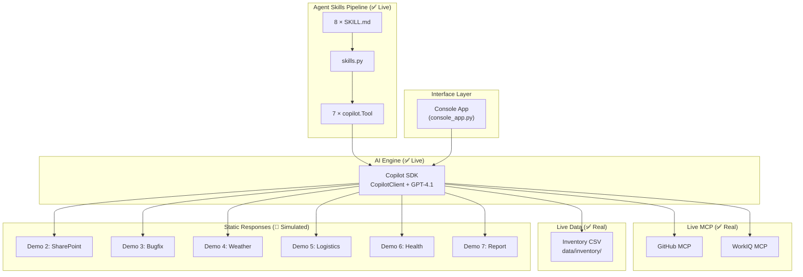

# Zava Smart Assistant — Technical Summary

> Presentation deck reference for Agents League TechConnect 2026

---

## 1. Problem Statement

### The Challenge

Enterprises face complex cross-regional incidents requiring coordination across multiple systems, teams, and time zones. Traditional incident response involves:

- Manual switching between 6+ tools (inventory, ticketing, knowledge base, monitoring, etc.)
- Slow information gathering across regions with different access permissions
- Lack of unified root cause analysis visibility
- Time-consuming report generation and follow-up coordination

### Our Solution

**Zava Smart Assistant** — an AI agent that unifies the entire incident response workflow into a single conversational interface, powered by the **GitHub Copilot SDK** with MCP (Model Context Protocol) integrations.

---

## 2. Core Technical Pattern: Copilot SDK Agent Skills

> **This is the central mechanism of the entire application.**

The system uses the Copilot SDK's **Agent Skills** feature to convert human-readable Markdown files into executable tools:

```
.github/skills/demo{1-8}-*/SKILL.md
    → src/skills.py (YAML frontmatter parser)
    → src/tools.py (converts to copilot.Tool objects)
    → CopilotClient.create_session(tools=[...])
    → GPT-4.1 decides which tool to call at runtime
```

### What Copilot SDK Provides

| Capability | How We Use It |
|------------|---------------|
| `CopilotClient` session management | Single session with GPT-4.1 + tools + MCP servers |
| `Tool` object registration | 7 tools built from SKILL.md files |
| MCP server integration | 2 live HTTP MCP (GitHub + WorkIQ) registered in session |
| Streaming event callbacks | Token-by-token response via `SessionEventType.ASSISTANT_MESSAGE_DELTA` |
| Tool execution events | `TOOL_EXECUTION_START` / `TOOL_EXECUTION_COMPLETE` for logging |
| LLM-driven routing | GPT-4.1 reads system prompt and decides tool selection (no manual router) |

---

## 3. Architecture Overview

### System Layers



### Data Flow

```
User Message
    → console_app.py captures input
    → CopilotClient.send_and_wait(prompt)
    → GPT-4.1 selects tool(s) based on system prompt
    → Tool handler executes:
        ├── Demo 1: live CSV → Markdown inventory report
        ├── Demo 8: redirect → WorkIQ MCP real call
        └── Demo 2-7: SKILL.md static response
    → LLM interprets and summarizes in natural language
    → Response streamed token-by-token to console
```

---

## 4. Real vs Simulated — Complete Breakdown

### ✅ Live Components (Fully Functional at Runtime)

| Component | Implementation | File(s) |
|-----------|----------------|---------|
| Copilot SDK engine | `CopilotClient` session, streaming, tool calling | `console_app.py` |
| Agent Skills pipeline | SKILL.md → parse → `copilot.Tool` | `src/skills.py`, `src/tools.py` |
| System prompt & governance | Permission escalation, MCP routing rules | `src/prompts.py` |
| GitHub MCP | HTTP MCP at `api.githubcopilot.com/mcp/` | `console_app.py` session config |
| WorkIQ MCP | HTTP MCP at `workiq.microsoft.com/mcp/` | `console_app.py` session config |
| Demo 1 inventory data | Real CSV files → Markdown report | `src/inventory_data.py`, `data/inventory/*.csv` |
| Agent registry & permissions | 7 agents with permission model | `src/agents.py` |
| Intent router | Keyword classification (standalone) | `src/router.py` |
| Automated tests | 181 tests, 100% passing | `tests/` |

### 🔶 Simulated Components (Pre-Authored Static Responses)

| Component | Actual Behavior | Why Simulated |
|-----------|-----------------|---------------|
| Fabric MCP | Reads local CSV, not real Fabric | No live Fabric Lakehouse in demo env |
| SharePoint MCP | Returns SKILL.md text | No live SharePoint site |
| Bing Search MCP | Returns SKILL.md text | Offline demo reliability |
| Logistics MCP | Returns SKILL.md text | No live logistics DB |
| Azure Monitor MCP | Returns SKILL.md text | No live Azure Monitor connected |
| Demo 2-7 responses | SKILL.md pre-authored Markdown | MCP backends not available |
| Custom agent switching | Shows info only, no session change | Feature placeholder |
| Permission escalation | System prompt instructions only | No programmatic checks |
| Playwright/Filesystem MCP | In config, not registered in session | Not needed for demo flow |

### 🔶 Reference Only (Not Integrated)

| Component | Description |
|-----------|-------------|
| `ref/01_inventory_agent_sample.py` | Standalone Foundry Agent via `azure-ai-projects` SDK |
| `ref/00_env_check.py` | Azure credential/connection validator |
| `ref/agent_utils.py` | Shared utilities for Foundry scripts |

---

## 5. Core Design Decisions

### 5.1 Copilot SDK as the Sole Runtime

**Why**: Rather than building a custom agent framework, we use the Copilot SDK as the unified AI runtime.

- **Tool calling** — SDK handles LLM → tool dispatch → response aggregation
- **MCP integration** — Live MCP servers registered directly in session config
- **Streaming** — Built-in event callbacks for real-time response display
- **System prompt** — Governs tool selection, permission rules, and response behavior

**Implementation** (`console_app.py`):
```python
client = CopilotClient()
session = await client.create_session({
    "model": "gpt-4.1",
    "streaming": True,
    "tools": tools,  # 7 copilot.Tool from SKILL.md
    "system_message": {"content": SYSTEM_MESSAGE},
    "mcp_servers": {
        "workiq": {"type": "http", "url": "https://workiq.microsoft.com/mcp/", "tools": ["*"]},
        "github": {"type": "http", "url": "https://api.githubcopilot.com/mcp/", "tools": ["*"]},
    },
})
```

### 5.2 Skill-as-Markdown Architecture

**Why**: Skills are defined as `SKILL.md` files with YAML frontmatter, not hardcoded Python functions.

**Pipeline**:
```
.github/skills/demo1-fabric-inventory/SKILL.md
    → skills.py: _parse_frontmatter() + _extract_triggers() + _extract_response()
    → Skill dataclass (name, description, triggers, response_content, demo_id)
    → tools.py: build_tools() → copilot.Tool(name, description, parameters, handler)
```

**Benefits**:
- **Non-developer editable** — Product managers can update skill responses
- **Version controlled** — Each skill is a separate file, easy to diff
- **Self-documenting** — The skill file IS the documentation
- **Hot-swappable** — Add/remove skills by adding/removing folders

### 5.3 LLM-Driven Routing (Not Code-Driven)

**Why**: The system prompt tells GPT-4.1 which tools exist and when to use them. The LLM decides routing at runtime.

**Key insight**: `src/router.py` (keyword-based intent router) exists as a testable standalone module with 50 test cases, but is **NOT called** in `console_app.py`. The LLM handles all routing decisions based on the system prompt in `src/prompts.py`.

### 5.4 MCP Dual-Mode + Live CSV Data

**Why**: MCP provides standard protocol for external data, but live demos need reliability.

**Three data tiers**:
1. **Live MCP** (GitHub, WorkIQ) — Real HTTP endpoints in SDK session
2. **Live CSV** (Demo 1) — `src/inventory_data.py` reads `data/inventory/*.csv` with anomaly detection
3. **Static fallback** (Demo 2-7) — Pre-authored SKILL.md responses

**Live CSV implementation** (`src/tools.py`):
```python
use_live_csv = skill.name == "fabric-inventory-query"
if use_live_csv:
    report = generate_inventory_report()  # reads CSV files
    return {"textResultForLlm": report, "resultType": "success"}
```

### 5.5 Permission Escalation (Prompt-Driven Governance)

**Why**: Demonstrates enterprise governance without code-level enforcement.

**Flow** (entirely in system prompt):
```
User requests cross-region data
    → LLM refuses: "I only have regional access"
    → LLM suggests: "Please ask your manager to approve temporary access"
    → User confirms: "It's been granted"
    → LLM proceeds with full access
    → Access is session-scoped
```

---

## 6. The 8 Skills — Detailed Breakdown

| Phase | Skill | Tool Handler | MCP | Data Status |
|-------|-------|-------------|-----|-------------|
| **Diagnose** | 1. Inventory Query | ✅ `generate_inventory_report()` → live CSV | fabric-mcp 🔶 | ✅ Live |
| | 2. Knowledge Base | 🔶 Static SKILL.md response | sharepoint-mcp 🔶 | 🔶 Static |
| **Fix** | 3. Bug Fix Agent | 🔶 Static SKILL.md response | — | 🔶 Static |
| **Verify** | 4. Weather Search | 🔶 Static SKILL.md response | bing-search-mcp 🔶 | 🔶 Static |
| | 5. Logistics Tracking | 🔶 Static SKILL.md response | logistics-mcp 🔶 | 🔶 Static |
| | 6. System Health | 🔶 Static SKILL.md response | azure-monitor-mcp 🔶 | 🔶 Static |
| **Report** | 7. Incident Report | 🔶 Static SKILL.md response | — | 🔶 Static |
| | 8. Meeting Booking | ✅ Redirect to live WorkIQ MCP | workiq-mcp ✅ | ✅ Live |

> Skills 2-7 use `LIVE_MCP_SKILLS` dict — when real MCP servers come online, simply add entries to switch from static to live.

---

## 7. Technology Stack

| Component | Technology | Live/Simulated |
|-----------|------------|----------------|
| AI Runtime | GitHub Copilot SDK (`CopilotClient`) | ✅ Live |
| LLM | GPT-4.1 | ✅ Live |
| Tool Pipeline | `src/skills.py` → `src/tools.py` → `copilot.Tool` | ✅ Live |
| Live MCP | GitHub MCP + WorkIQ MCP (HTTP) | ✅ Live |
| Inventory Data | `src/inventory_data.py` → CSV files | ✅ Live |
| Agent Framework | `src/agents.py` (7 agents + permission model) | ✅ Metadata |
| Intent Router | `src/router.py` (keyword-based) | ✅ Standalone |
| System Prompt | `src/prompts.py` | ✅ Live |
| Console UI | Python asyncio (`console_app.py`) | ✅ Live |
| Skill Definition | YAML + Markdown (`.github/skills/`) | ✅ Live |
| Static MCP | Fabric, SharePoint, Bing, Logistics, Azure Monitor | 🔶 Metadata labels |
| Custom Agents | `config/agent.json` (3 agents) | 🔶 Display only |
| Config | python-dotenv | ✅ Live |
| Testing | pytest (181 tests) | ✅ Live |
| Language | Python 3.11+ | ✅ |

---

## 8. Key Differentiators

### vs. Traditional Chatbot

| Aspect | Traditional Chatbot | Zava |
|--------|-------------------|------|
| Tool Orchestration | Rules-based routing | LLM decides which tools to call |
| Multi-tool Chains | One tool per turn | Multiple tools in a single turn |
| Governance | Role-based access control | Prompt-driven permission escalation |
| Skill Management | Code changes required | Edit Markdown files |
| Data Sources | Direct API calls | MCP protocol + SKILL.md fallback |

### vs. Raw LLM API

| Aspect | Raw API | Zava |
|--------|---------|------|
| Tool Calling | Manual implementation | Copilot SDK handles routing |
| Streaming | Build your own | Built-in event callbacks |
| MCP Integration | Not available | SDK-native MCP support |
| Context Management | Token counting | Session-based |
| Extensibility | API refactoring | Drop-in SKILL.md files |

---

## 9. Technical Highlights

> The entire agent capability system is driven by Markdown files — product managers can add or modify skills without touching Python code. The Copilot SDK Agent Skills pipeline (`SKILL.md → YAML parser → copilot.Tool`) is the core innovation, with GPT-4.1 handling all routing decisions purely through system prompt governance, including a human-in-the-loop permission escalation pattern for cross-regional data access.

### Copilot SDK as Universal Interface
- Uses **GitHub Copilot SDK** as the unified conversational interface
- Embeddable into **any UI** — console, web, Teams, or custom frontends — with the same agent pipeline underneath
- All tool calling, streaming, and MCP integration handled by the SDK session layer

### Markdown-Driven Agent Skills (Dynamic Import)
- Agent capabilities are defined entirely in **Markdown files** (`SKILL.md`), not Python code
- Skills are **dynamically imported** at startup via the Agent Skills pipeline: `SKILL.md → YAML parser → copilot.Tool`
- Product managers and non-developers can add or modify skills by editing Markdown — **zero code changes required**

### Unified Integration: Custom Agents + MCP + WorkIQ
- Orchestrates **7 specialized agents**, **3 switchable custom agents**, and **9 MCP connectors** under one session
- **MCP protocol** provides standardized connectivity to GitHub, WorkIQ (M365), Fabric, SharePoint, Bing, and more
- **WorkIQ MCP** enables real-time M365 calendar queries and meeting scheduling directly from the agent conversation

### Microsoft Foundry Agent — Enterprise-Grade Backend
- Backend connects to **Microsoft Foundry Agent** via `azure-ai-projects` SDK for production-grade deployment
- Leverages Microsoft platform capabilities for **authentication**, **audit management**, **compliance logging**, and **identity governance**
- Demonstrates the path from Copilot SDK POC → production Foundry Agent with enterprise controls

### Microsoft Fabric — Central Data Platform
- Backend data layer managed through **Microsoft Fabric** for unified data lakehouse access
- Inventory, customer complaints, and operational data flow through Fabric's centralized data governance
- Enables consistent data access policies across all agents and regions

### GitHub Integration — Delegated Coding Agent
- **GitHub MCP** (live) provides direct integration with GitHub repositories, issues, and pull requests
- Supports **delegated coding agent** workflows — the AI agent can create PRs, review code, and trigger CI/CD
- Seamless integration with GitHub Copilot ecosystem for end-to-end developer experience

### Permission & Access Control — Foundry + Central Data Platform
- Permission management unified through **Microsoft Foundry** and the **central data platform**
- Multi-level agent permissions (🔴 High / 🟡 Medium / 🟢 Low) with **human-in-the-loop** escalation for cross-regional data access
- **Prompt-driven governance** ensures LLM adheres to enterprise policies — manager approval required before accessing cross-region data

### Additional Highlights
- **MCP Dual-Mode** — 2 live MCP servers + 5 static labels with offline fallback, solving live demo reliability
- **Multi-Phase Incident Workflow** — 8 skills organized into 4 logical phases (Diagnose → Fix → Verify → Report)
- **Transparent Real/Simulated Labeling** — every component explicitly marked as live or simulated

---

## 10. Demo Scenario Walkthrough

```
Phase 1: DIAGNOSE (Skills 1-2)
├── "Check inventory across TW/JP/US"
│   → Permission denied → Manager approval → Cross-region query
│   → ✅ Demo 1: Live CSV data from data/inventory/
│   → Result: TW 3,270 / JP 700 normal, US only 3 boxes ⚠️ Critical
├── "Why does the website show out of stock?"
│   → 🔶 Demo 2: Static SKILL.md response
│   → Knowledge base finds past sync-delay incidents
│
Phase 2: FIX (Skill 3)
├── "Can you fix the bug?"
│   → 🔶 Demo 3: Static SKILL.md response
│   → GitHub Agent: API timeout 5s→30s, add retry, fix error handling
│   → PR created, CI passed
│
Phase 3: VERIFY (Skills 4-6)
├── "Why is US inventory so low?"
│   → 🔶 Demo 4: Static weather response
│   → 🔶 Demo 5: Static logistics response
│   → Weather: US East Coast blizzard → logistics delayed
│   → Logistics: 300 units arriving this afternoon
├── "Make sure US sync is also fixed"
│   → 🔶 Demo 6: Static health response
│   → System health: all green, sync rate 87.3%→99.8%
│
Phase 4: REPORT (Skills 7-8)
├── "Generate incident report and schedule meeting"
│   → 🔶 Demo 7: Static report template
│   → ✅ Demo 8: Live WorkIQ MCP → real M365 calendar data
│   → Report auto-generated, meeting booked: 3:00 PM
│
Resolution: Complete incident handled in one conversation
```

---

## 11. Submission Compliance

| Requirement | Status |
|-------------|--------|
| GitHub Copilot usage documented | ✅ |
| Creative application with unique concept | ✅ |
| MCP integration (GitHub + WorkIQ live) | ✅ |
| No hardcoded credentials | ✅ |
| No PII or confidential data | ✅ |
| Public repository with README | ✅ |
| Real vs simulated clearly labeled | ✅ |
| Automated test suite (181 tests) | ✅ |
| Demo materials included | ⏳ TODO |
| Original work | ✅ |
