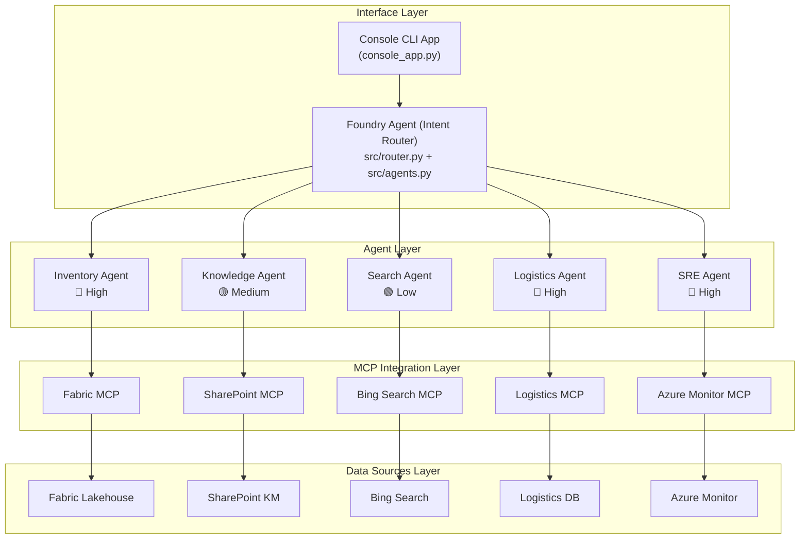

# Zava Smart Assistant — Technical Summary

> Presentation deck reference for Agents League TechConnect 2026

---

## 1. Problem Statement

### The Challenge

Enterprises face complex cross-regional incidents that require coordinating across multiple systems, teams, and time zones. Traditional incident response involves:

- Manual switching between 6+ different tools (inventory, ticketing, knowledge base, monitoring, etc.)
- Slow information gathering across regions with different access permissions
- Lack of unified visibility into root cause analysis
- Time-consuming report generation and follow-up coordination

### Our Solution

**Zava Smart Assistant** — an AI agent that unifies the entire incident response workflow into a single conversational interface, powered by the GitHub Copilot SDK with MCP (Model Context Protocol) integrations.

---

## 2. Architecture Overview

### System Layers



Also includes GitHub Agents (Coding Agent + Copilot) operating alongside the Foundry-routed agents.

### Data Flow

```
User Message
    → Console captures input
    → Foundry Agent classifies intent (src/router.py)
    → Routes to specialized agent based on intent & permission
    → Agent calls MCP connector for data source access
    → Results aggregated and summarized in natural Chinese
    → Streamed back token-by-token to UI
```

---

## 3. Core Design Decisions

### 3.1 Foundry Agent as Orchestrator

**Why**: Instead of a flat single-agent architecture, we use Foundry Agent as the central orchestrator that routes intents to specialized agents.

- **Intent-based routing** — Foundry Agent classifies user input and dispatches to the right agent
- **Permission isolation** — Each agent has explicit permission levels (🔴 High / 🟡 Medium / 🟢 Low)
- **Audit trail** — Every routing decision is logged with confidence scores
- **Elastic scaling** — New agents can be added without modifying existing ones

**Implementation**:
```python
from src.router import FoundryRouter

router = FoundryRouter()
agent, intent, confidence = router.route(user_input)
# → (InventoryAgent, INVENTORY_QUERY, 0.85)
```

### 3.2 Skill-as-Markdown Architecture

**Why**: Skills are defined as `SKILL.md` files with YAML frontmatter, not hardcoded Python functions.

**Benefits**:
- **Non-developer editable** — Product managers can update skill responses without touching code
- **Version controlled** — Each skill is a separate file, easy to diff and review
- **Self-documenting** — The skill file IS the documentation
- **Hot-swappable** — Add/remove skills by adding/removing files

**Structure**:
```yaml
---
name: fabric-inventory-query
description: 'Query inventory data from Fabric Lakehouse'
---
## Trigger Conditions
- keyword1
- keyword2
## Default Response
<response content in Markdown>
```

### 3.3 MCP Integration with Graceful Degradation

**Why**: MCP provides a standard protocol for connecting to external data sources, but live demos need reliability.

**Design**:
- MCP servers (GitHub, WorkIQ) are used when available
- If MCP is unavailable, tools fall back to pre-authored responses
- This dual-mode ensures the demo works offline while showcasing real MCP capability online

### 3.4 Permission Escalation (Human-in-the-Loop)

**Why**: Demonstrates enterprise governance patterns — agents shouldn't have unrestricted access.

**Flow**:
```
User requests cross-region data
    → Agent refuses: "I only have regional access"
    → Agent suggests: "Please ask your manager to approve temporary access"
    → User confirms: "It's approved"
    → Agent proceeds with full access
    → Access is session-scoped (24h simulated)
```

This is implemented entirely in the system prompt, not in code — showcasing how LLM behavioral constraints can enforce governance policies.

---

## 4. The 8 Skills — Detailed Breakdown

| Phase | Skill | Simulated Backend | MCP | Purpose |
|-------|-------|-------------------|-----|---------|
| **Diagnose** | 1. Inventory Query | Fabric Lakehouse | Fabric MCP | Identify which regions are affected |
| | 2. Knowledge Base | SharePoint | SharePoint MCP | Find past incidents with similar patterns |
| **Fix** | 3. Bug Fix Agent | GitHub Coding Agent | — | Auto-analyze and fix root cause code |
| **Verify** | 4. Weather Search | Bing Search | Bing Search MCP | Check external factors (weather, logistics) |
| | 5. Logistics Tracking | Logistics DB | Logistics MCP | Confirm shipment ETA |
| | 6. System Health | Azure Monitor | Azure Monitor MCP | Verify fix effectiveness |
| **Report** | 7. Incident Report | GitHub Copilot | — | Generate comprehensive incident report |
| | 8. Meeting Booking | WorkIQ / M365 | WorkIQ MCP | Schedule follow-up meeting |

---

## 5. Technology Stack

| Component | Technology | Purpose |
|-----------|------------|---------|
| AI Runtime | GitHub Copilot SDK | Session management, tool calling, streaming |
| Orchestration | Foundry Agent | Intent routing, agent dispatch, permission checks |
| Agent Framework | src/agents.py | Agent definitions, permission model |
| Intent Router | src/router.py | Keyword-based intent classification |
| LLM | GPT-4.1 | Intent understanding, response generation |
| Console UI | Python asyncio | Terminal-based interface |
| Skill Definition | YAML + Markdown | Declarative skill configuration |
| MCP Client | GitHub MCP, WorkIQ MCP | External service integration |
| Config | python-dotenv | Environment variable management |
| Language | Python 3.11+ | Async/await, type hints |

---

## 6. Key Differentiators

### vs. Traditional Chatbot

| Aspect | Traditional Chatbot | Zava |
|--------|-------------------|------|
| Tool Orchestration | Rules-based routing | LLM decides which tools to call |
| Multi-tool Chains | One tool per turn | Multiple tools in a single turn |
| Governance | Role-based access control | AI-enforced permission escalation |
| Skill Management | Code changes required | Edit Markdown files |
| Data Sources | Direct API calls | MCP protocol abstraction |

### vs. Raw LLM API

| Aspect | Raw API | Zava |
|--------|---------|------|
| Tool Calling | Manual implementation | Copilot SDK handles routing |
| Streaming | Build your own | Built-in event callbacks |
| Context Management | Token counting | Session-based |
| Extensibility | API refactoring | Drop-in SKILL.md files |

---

## 7. Innovation Highlights

1. **Multi-Agent Permission Model** — 6 specialized agents classified by permission level (🔴 High / 🟡 Medium / 🟢 Low), enforcing least-privilege access across the agent ecosystem

2. **Foundry Agent Orchestration** — Centralized intent router that dispatches to specialized agents, demonstrating enterprise-grade agent coordination patterns

3. **Skill-as-Markdown** — A novel pattern where agent capabilities are defined in human-readable Markdown files, making the agent configuration accessible to non-developers

4. **Prompt-Driven Governance** — Permission escalation is enforced purely through system prompt design, demonstrating that LLM behavioral constraints can implement real enterprise policies

5. **MCP Dual-Mode** — Real MCP integration (6 connectors) with offline fallback, solving the live demo reliability challenge while preserving authentic MCP showcase

6. **Multi-Phase Incident Workflow** — The 8 skills are organized into 4 logical phases (Diagnose → Fix → Verify → Report), demonstrating how an AI agent can guide users through complex multi-step processes

---

## 8. Demo Scenario Walkthrough

```
Phase 1: DIAGNOSE (Skills 1-2)
├── "Check inventory across TW/JP/US"
│   → Permission denied → Manager approval → Cross-region query
│   → Result: TW/JP normal, US only 3 units left
├── "Why does the website show out of stock?"
│   → Knowledge base finds past sync-delay incidents
│
Phase 2: FIX (Skill 3)
├── "Can you fix the bug?"
│   → GitHub Agent: API timeout 5s→30s, add retry, fix error handling
│   → PR created, CI passed, MDC compliant
│
Phase 3: VERIFY (Skills 4-6)
├── "Why is US inventory so low?"
│   → Weather: US East Coast blizzard → logistics delayed
│   → Logistics: 300 units arriving this afternoon
├── "Make sure US sync is also fixed"
│   → System health: all green, sync rate 87.3%→99.8%
│
Phase 4: REPORT (Skills 7-8)
├── "Generate incident report and schedule meeting"
│   → Report auto-generated with full timeline
│   → Meeting booked: 3:00 PM with Product Manager
│
Resolution: Complete incident handled in one conversation
```

---

## 9. Submission Compliance

| Requirement | Status |
|-------------|--------|
| GitHub Copilot usage documented | ✅ |
| Creative application with unique concept | ✅ |
| MCP integration (GitHub + WorkIQ) | ✅ |
| No hardcoded credentials | ✅ |
| No PII or confidential data | ✅ |
| Public repository with README | ✅ |
| Demo materials included | ⏳ TODO |
| Original work | ✅ |
